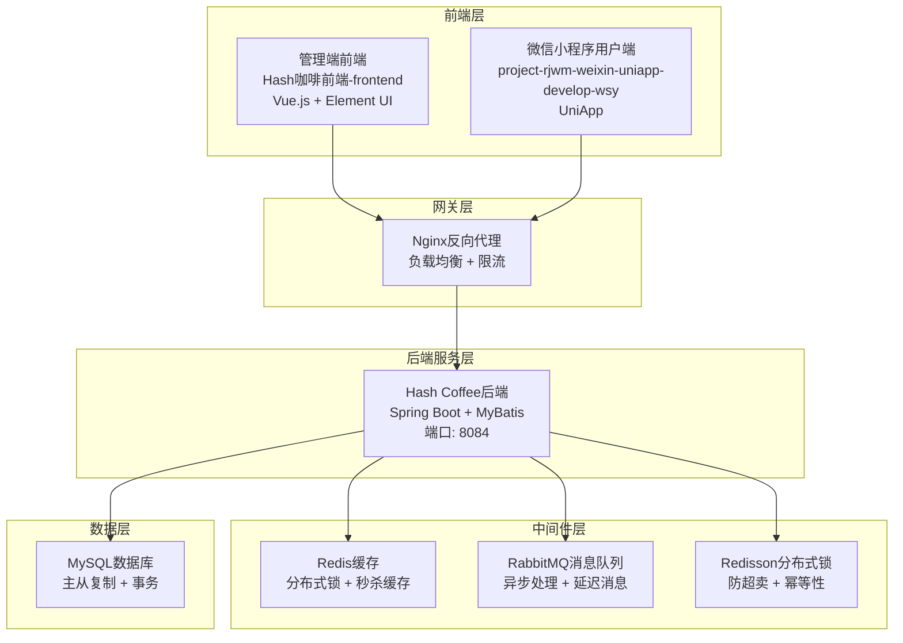

# Hash咖啡项目后端改造指南 - 第一部分：项目概述和数据库设计

## 目录
1. [项目概述](#项目概述)
2. [技术栈说明](#技术栈说明)
3. [整体架构设计](#整体架构设计)
4. [数据库设计完善](#数据库设计完善)
5. [下一步计划](#下一步计划)

---

## 项目概述

本指南将基于现有的Hash咖啡项目，实现一个完整的分布式秒杀系统，包含以下核心功能：

- **分布式锁防超卖**：基于Redisson和Lua脚本实现高并发场景下的库存控制
- **消息队列解耦**：RabbitMQ异步处理订单支付和积分系统
- **多端支持**：管理端、用户端、微信小程序统一后端服务
- **完整部署**：Docker + Nginx配置，支持生产环境部署

### 功能目标
- 实现高并发的秒杀活动系统
- 防止超卖和重复参与
- 支持分布式部署
- 提供用户友好的界面
- 保证数据一致性和系统稳定性

---

## 技术栈说明

| 组件 | 技术选型 | 版本 | 作用 |
|------|----------|------|------|
| 后端框架 | Spring Boot | 2.7.3 | 主框架，提供基础功能 |
| 数据库 | MySQL | 8.0 | 数据持久化存储 |
| 缓存 | Redis | 6.2 | 缓存和分布式锁 |
| 消息队列 | RabbitMQ | 3.9 | 异步消息处理 |
| 分布式锁 | Redisson | 3.17.7 | 防超卖和并发控制 |
| 管理端前端 | Vue.js + Element UI | - | 管理端界面（苍穹外卖前端-frontend） |
| 用户端 | UniApp | - | 微信小程序用户端（project-rjwm-weixin-uniapp-develop-wsy） |
| 反向代理 | Nginx | - | 负载均衡和静态资源服务 |

### 核心技术特性
- **高并发处理**：Redis缓存 + 分布式锁
- **异步解耦**：RabbitMQ消息队列
- **数据一致性**：Lua脚本保证原子性操作
- **系统监控**：健康检查和日志记录
- **限流保护**：Nginx层面的请求限流

---

## 整体架构设计

### 架构图



### 数据流向

1. **管理员访问流程**：
   - 管理员通过管理端前端(Vue.js)发起请求
   - Nginx接收请求并进行反向代理
   - 后端服务处理业务逻辑
   - 返回响应给管理员

2. **用户访问流程**：
   - 用户通过微信小程序(UniApp)发起请求
   - Nginx接收请求并进行反向代理
   - 后端服务处理业务逻辑
   - 返回响应给用户

3. **秒杀流程**：
   - 用户参与秒杀活动
   - Redis分布式锁防止重复参与
   - Lua脚本保证库存扣减原子性
   - 异步创建订单和更新数据库

4. **消息队列流程**：
   - 订单支付成功后发送消息
   - RabbitMQ异步处理积分计算
   - 解耦支付服务和积分服务

---

## 数据库设计完善

### 现有数据库表结构

项目已经包含了完整的数据库设计（`script3.sql`），主要包括：

#### 核心业务表

**1. 秒杀活动表 (seckill_activity)**
```sql
CREATE TABLE seckill_activity (
    id BIGINT AUTO_INCREMENT COMMENT '活动ID' PRIMARY KEY,
    name VARCHAR(100) NOT NULL COMMENT '活动名称',
    description TEXT COMMENT '活动描述',
    dish_id BIGINT NOT NULL COMMENT '菜品ID',
    seckill_price DECIMAL(10,2) NOT NULL COMMENT '秒杀价格',
    original_price DECIMAL(10,2) NOT NULL COMMENT '原价',
    stock INT NOT NULL COMMENT '秒杀库存',
    sold_count INT DEFAULT 0 COMMENT '已售数量',
    per_user_limit INT DEFAULT 1 COMMENT '每人限购数量',
    start_time DATETIME NOT NULL COMMENT '开始时间',
    end_time DATETIME NOT NULL COMMENT '结束时间',
    status TINYINT(1) DEFAULT 1 COMMENT '状态：1-启用，0-禁用',
    create_time DATETIME DEFAULT CURRENT_TIMESTAMP COMMENT '创建时间',
    update_time DATETIME DEFAULT CURRENT_TIMESTAMP ON UPDATE CURRENT_TIMESTAMP COMMENT '更新时间',
    create_user BIGINT COMMENT '创建人',
    update_user BIGINT COMMENT '修改人'
);
```

**2. 秒杀订单表 (seckill_order)**
```sql
CREATE TABLE seckill_order (
    id BIGINT AUTO_INCREMENT COMMENT '主键ID' PRIMARY KEY,
    activity_id BIGINT NOT NULL COMMENT '秒杀活动ID',
    user_id BIGINT NOT NULL COMMENT '用户ID',
    dish_id BIGINT NOT NULL COMMENT '商品ID',
    quantity INT NOT NULL COMMENT '购买数量',
    seckill_price DECIMAL(10,2) NOT NULL COMMENT '秒杀价格',
    total_amount DECIMAL(10,2) NOT NULL COMMENT '总金额',
    status TINYINT(1) DEFAULT 0 COMMENT '订单状态：0-待支付，1-已支付，2-已取消',
    create_time DATETIME DEFAULT CURRENT_TIMESTAMP COMMENT '创建时间',
    update_time DATETIME DEFAULT CURRENT_TIMESTAMP ON UPDATE CURRENT_TIMESTAMP COMMENT '更新时间'
);
```

**3. 秒杀参与记录表 (seckill_participant)**
```sql
CREATE TABLE seckill_participant (
    id BIGINT AUTO_INCREMENT COMMENT '主键ID' PRIMARY KEY,
    activity_id BIGINT NOT NULL COMMENT '秒杀活动ID',
    user_id BIGINT NOT NULL COMMENT '用户ID',
    quantity INT NOT NULL COMMENT '参与数量',
    status TINYINT(1) DEFAULT 0 COMMENT '状态：0-待处理，1-成功，2-失败',
    create_time DATETIME DEFAULT CURRENT_TIMESTAMP COMMENT '创建时间',
    update_time DATETIME DEFAULT CURRENT_TIMESTAMP ON UPDATE CURRENT_TIMESTAMP COMMENT '更新时间',
    UNIQUE KEY uk_user_activity (user_id, activity_id)
);
```

**4. 库存扣减记录表 (seckill_stock_log)**
```sql
CREATE TABLE seckill_stock_log (
    id BIGINT AUTO_INCREMENT COMMENT '主键ID' PRIMARY KEY,
    activity_id BIGINT NOT NULL COMMENT '秒杀活动ID',
    user_id BIGINT NOT NULL COMMENT '用户ID',
    quantity INT NOT NULL COMMENT '扣减数量',
    before_stock INT NOT NULL COMMENT '扣减前库存',
    after_stock INT NOT NULL COMMENT '扣减后库存',
    status TINYINT(1) DEFAULT 1 COMMENT '状态：1-成功，0-失败',
    create_time DATETIME DEFAULT CURRENT_TIMESTAMP COMMENT '创建时间'
);
```

#### 优惠券相关表

**5. 优惠券模板表 (coupon_template)**
```sql
CREATE TABLE coupon_template (
    id BIGINT AUTO_INCREMENT COMMENT '模板ID' PRIMARY KEY,
    name VARCHAR(100) NOT NULL COMMENT '优惠券名称',
    description VARCHAR(500) COMMENT '优惠券描述',
    type TINYINT(1) NOT NULL COMMENT '优惠券类型：1-满减券，2-折扣券，3-代金券',
    discount_type TINYINT(1) NOT NULL COMMENT '折扣类型：1-固定金额，2-百分比',
    discount_value DECIMAL(10,2) NOT NULL COMMENT '折扣值',
    min_amount DECIMAL(10,2) DEFAULT 0.00 COMMENT '最低消费金额',
    total_count INT NOT NULL COMMENT '发放总数量',
    used_count INT DEFAULT 0 COMMENT '已使用数量',
    per_user_limit INT DEFAULT 1 COMMENT '每人限领数量',
    valid_days INT COMMENT '有效天数',
    start_time DATETIME NOT NULL COMMENT '开始时间',
    end_time DATETIME NOT NULL COMMENT '结束时间',
    status TINYINT(1) DEFAULT 1 COMMENT '状态：1-启用，0-禁用'
);
```

**6. 优惠券表 (coupon)**
```sql
CREATE TABLE coupon (
    id BIGINT AUTO_INCREMENT COMMENT '优惠券ID' PRIMARY KEY,
    template_id BIGINT NOT NULL COMMENT '模板ID',
    user_id BIGINT NOT NULL COMMENT '用户ID',
    code VARCHAR(32) NOT NULL COMMENT '优惠券码',
    status TINYINT(1) DEFAULT 0 COMMENT '状态：0-未使用，1-已使用，2-已过期',
    used_time DATETIME COMMENT '使用时间',
    order_id BIGINT COMMENT '使用订单ID',
    create_time DATETIME DEFAULT CURRENT_TIMESTAMP COMMENT '创建时间',
    update_time DATETIME DEFAULT CURRENT_TIMESTAMP ON UPDATE CURRENT_TIMESTAMP COMMENT '更新时间',
    UNIQUE KEY uk_code (code)
);
```

#### 系统配置表

**7. 系统配置表 (system_config)**
```sql
CREATE TABLE system_config (
    id BIGINT AUTO_INCREMENT COMMENT 'ID' PRIMARY KEY,
    config_key VARCHAR(100) NOT NULL COMMENT '配置键',
    config_value TEXT COMMENT '配置值',
    description VARCHAR(255) COMMENT '描述',
    create_time DATETIME DEFAULT CURRENT_TIMESTAMP COMMENT '创建时间',
    update_time DATETIME DEFAULT CURRENT_TIMESTAMP ON UPDATE CURRENT_TIMESTAMP COMMENT '更新时间',
    UNIQUE KEY uk_config_key (config_key)
);
```

**8. 用户积分记录表 (user_points_log)**
```sql
CREATE TABLE user_points_log (
    id BIGINT AUTO_INCREMENT COMMENT 'ID' PRIMARY KEY,
    user_id BIGINT NOT NULL COMMENT '用户ID',
    order_id BIGINT COMMENT '订单ID',
    points INT NOT NULL COMMENT '积分变化',
    type TINYINT(1) NOT NULL COMMENT '类型：1-获得，2-消费',
    description VARCHAR(255) COMMENT '描述',
    create_time DATETIME DEFAULT CURRENT_TIMESTAMP COMMENT '创建时间'
);
```

### 数据库索引优化

为了提升查询性能，建议添加以下索引：

```sql
-- 秒杀活动表索引
CREATE INDEX idx_seckill_time_status ON seckill_activity(start_time, end_time, status);
CREATE INDEX idx_seckill_dish_time ON seckill_activity(dish_id, start_time, end_time, status);

-- 秒杀订单表索引
CREATE INDEX idx_seckill_order_user_time ON seckill_order(user_id, create_time);
CREATE INDEX idx_seckill_order_activity_status ON seckill_order(activity_id, status);

-- 秒杀参与记录表索引
CREATE INDEX idx_participant_activity ON seckill_participant(activity_id);
CREATE INDEX idx_participant_user ON seckill_participant(user_id);

-- 优惠券表索引
CREATE INDEX idx_coupon_user_status ON coupon(user_id, status);
CREATE INDEX idx_coupon_template_time ON coupon_template(start_time, end_time, status);
```

### 数据库设计特点

1. **完整性**：包含秒杀活动的完整生命周期管理
2. **一致性**：通过外键约束保证数据一致性
3. **性能**：合理的索引设计提升查询效率
4. **扩展性**：预留字段支持未来功能扩展
5. **审计**：完整的创建和更新时间记录

---

## 下一步计划

在接下来的部分中，我们将详细讲解：

- **第二部分**：实体类和分布式锁实现
  - 实体类设计（SeckillParticipant、SeckillOrder、SeckillStockLog）
  - DTO类创建（SeckillParticipateDTO、SeckillOrderDTO）
  - Mapper接口实现和XML配置
  - 分布式锁服务（DistributedLockService）
  - Lua脚本实现（防超卖核心逻辑）
  - 服务层增强（SeckillActivityServiceImpl）

- **第三部分**：消息队列和API接口
  - RabbitMQ配置和消息队列架构
  - 消息实体类设计（OrderPayMessage、PointsEarnMessage等）
  - 消息生产者服务（MessageProducerService）
  - 消息消费者服务（MessageConsumerService）
  - API接口开发（用户端控制器）
  - 配置文件完善和部署测试

每个部分都会提供完整的代码示例和详细的实现说明，确保你可以按照指南逐步完成后端改造。

---

*继续阅读：[Hash咖啡后端改造指南 - 第二部分：实体类和分布式锁实现](./Hash咖啡后端改造指南-第二部分-实体类和分布式锁实现.md)*
