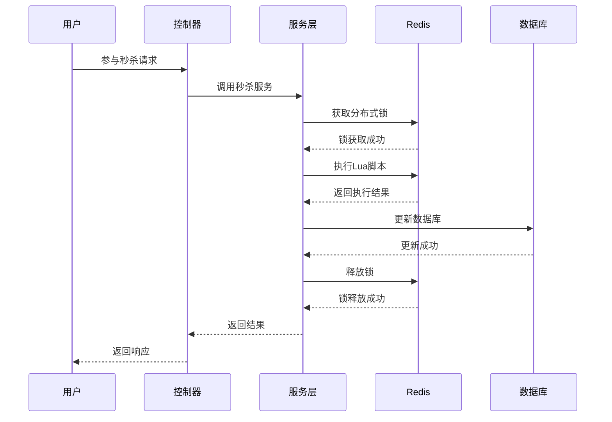
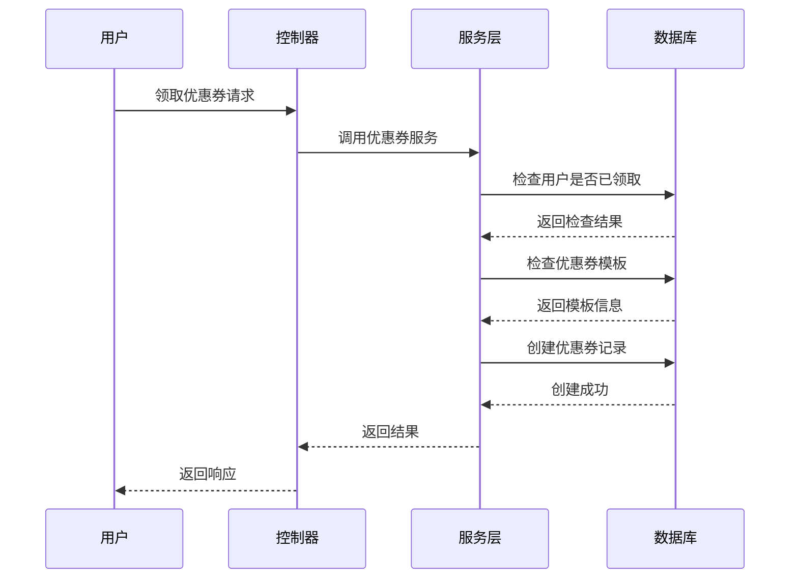
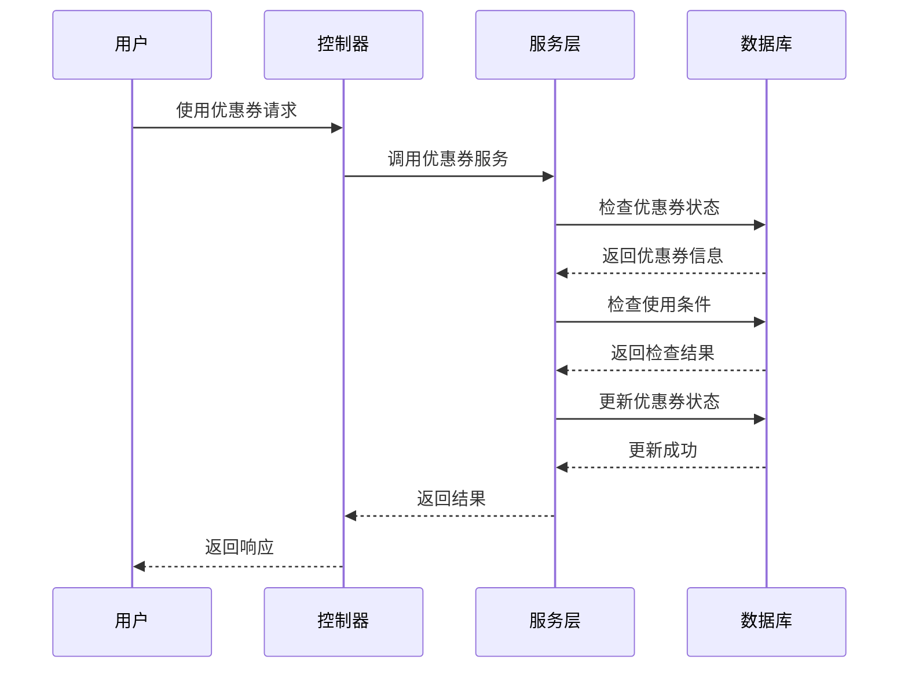
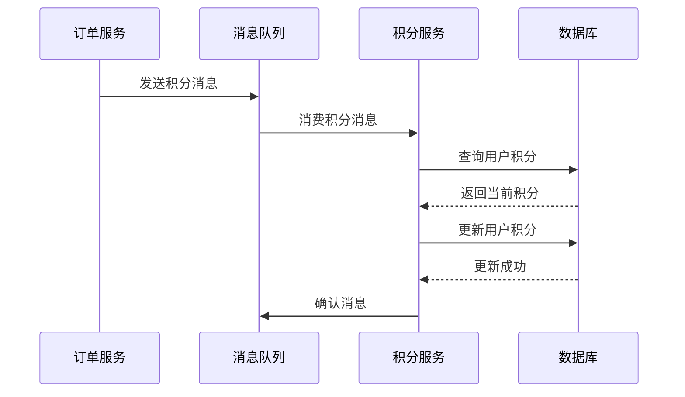
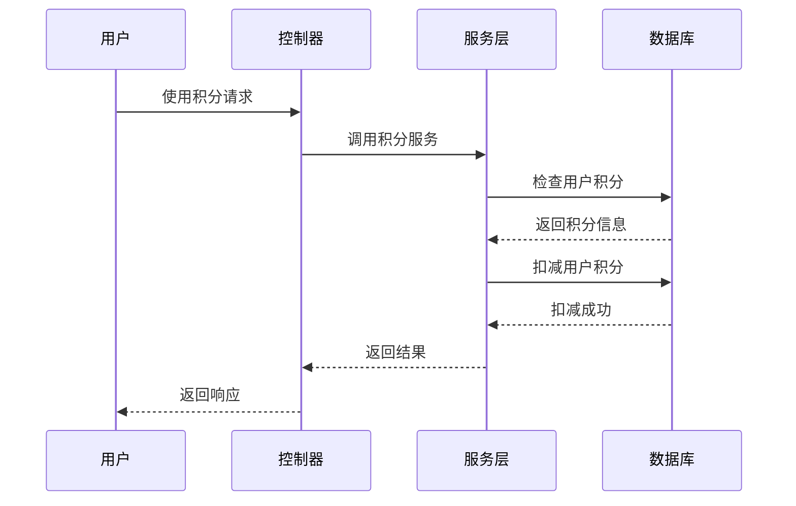

# Hash咖啡后端改造指南-第二部分-实体类和分布式锁实现

## 目录
1. [项目概述](#1-项目概述)
2. [实体类设计](#2-实体类设计)
3. [分布式锁实现](#3-分布式锁实现)
4. [Lua脚本优化](#4-lua脚本优化)
5. [数据库操作优化](#5-数据库操作优化)
6. [缓存策略](#6-缓存策略)
7. [异常处理](#7-异常处理)
8. [性能监控](#8-性能监控)
9. [业务流程详解](#9-业务流程详解)
10. [性能优化策略](#10-性能优化策略)
11. [监控和告警](#11-监控和告警)
12. [测试策略](#12-测试策略)
13. [部署和运维](#13-部署和运维)

## 概述

本部分主要介绍Hash咖啡项目中秒杀和优惠券功能的实体类设计、分布式锁实现，以及相关的Service层扩展。通过Lua脚本与Redisson分布式锁防止优惠券超卖与重复获取，同时通过MySQL数据库的原子性操作保证库存扣减的线程安全。

## 1. 实体类扩展

### 1.1 用户实体类扩展

**文件位置**: `sky-pojo/src/main/java/com/sky/entity/User.java`

```java
package com.sky.entity;

import lombok.AllArgsConstructor;
import lombok.Builder;
import lombok.Data;
import lombok.NoArgsConstructor;

import java.io.Serializable;
import java.time.LocalDate;
import java.time.LocalDateTime;

@Data
@Builder
@NoArgsConstructor
@AllArgsConstructor
public class User implements Serializable {

    private static final long serialVersionUID = 1L;
    
    private Long id;
    
    //微信用户唯一标识
    private String openid;

    //姓名
    private String name;

    //手机号
    private String phone;

    //性别 0 女 1 男
    private String sex;

    //身份证号
    private String idNumber;

    //头像
    private String avatar;
    
    //积分
    private Integer points;

    //注册时间
    private LocalDateTime createTime;
}
```

**主要变更说明**:
- 添加了 `points` 字段用于存储用户积分
- 积分系统是用户忠诚度管理的重要组成部分
- 积分可以用于兑换优惠券、抵扣现金等

**业务价值**:
1. **用户留存**: 通过积分系统提高用户粘性
2. **消费激励**: 积分奖励机制促进用户消费
3. **数据分析**: 积分数据可用于用户行为分析

### 1.2 消息实体类设计

#### 1.2.1 订单支付消息

**文件位置**: `sky-pojo/src/main/java/com/sky/entity/message/OrderPayMessage.java`

```java
package com.sky.entity.message;

import lombok.AllArgsConstructor;
import lombok.Builder;
import lombok.Data;
import lombok.NoArgsConstructor;
import java.io.Serializable;
import java.math.BigDecimal;
import java.time.LocalDateTime;

/**
 * 订单支付消息
 * 用于异步处理订单支付后的业务逻辑
 */
@Data
@Builder
@NoArgsConstructor
@AllArgsConstructor
public class OrderPayMessage implements Serializable {
    private static final long serialVersionUID = 1L;
    
    /**
     * 订单ID
     */
    private Long orderId;
    
    /**
     * 用户ID
     */
    private Long userId;
    
    /**
     * 支付金额
     */
    private BigDecimal amount;
    
    /**
     * 支付时间
     */
    private LocalDateTime payTime;
    
    /**
     * 支付方式
     * 1-微信支付 2-支付宝 3-银行卡
     */
    private Integer payMethod;
}
```

**设计理念**:
- 使用消息队列解耦支付服务和积分服务
- 提高系统响应速度和稳定性
- 支持异步处理，避免同步阻塞

#### 1.2.2 积分获得消息

**文件位置**: `sky-pojo/src/main/java/com/sky/entity/message/PointsEarnMessage.java`

```java
package com.sky.entity.message;

import lombok.AllArgsConstructor;
import lombok.Builder;
import lombok.Data;
import lombok.NoArgsConstructor;
import java.io.Serializable;
import java.time.LocalDateTime;

/**
 * 积分获得消息
 * 用于处理用户积分增加的业务逻辑
 */
@Data
@Builder
@NoArgsConstructor
@AllArgsConstructor
public class PointsEarnMessage implements Serializable {
    private static final long serialVersionUID = 1L;
    
    /**
     * 用户ID
     */
    private Long userId;
    
    /**
     * 订单ID
     */
    private Long orderId;
    
    /**
     * 获得积分
     */
    private Integer points;
    
    /**
     * 获得时间
     */
    private LocalDateTime earnTime;
}
```

**业务规则**:
- 每消费1元获得1积分
- 积分有效期为1年
- 积分可用于兑换优惠券

#### 1.2.3 订单超时消息

**文件位置**: `sky-pojo/src/main/java/com/sky/entity/message/OrderTimeoutMessage.java`

```java
package com.sky.entity.message;

import lombok.AllArgsConstructor;
import lombok.Builder;
import lombok.Data;
import lombok.NoArgsConstructor;
import java.io.Serializable;
import java.time.LocalDateTime;

/**
 * 订单超时消息
 * 用于处理订单超时未支付的业务逻辑
 */
@Data
@Builder
@NoArgsConstructor
@AllArgsConstructor
public class OrderTimeoutMessage implements Serializable {
    private static final long serialVersionUID = 1L;
    
    /**
     * 订单ID
     */
    private Long orderId;
    
    /**
     * 用户ID
     */
    private Long userId;
    
    /**
     * 超时时间
     */
    private LocalDateTime timeoutTime;
}
```

**超时处理机制**:
- 订单创建后15分钟内未支付自动取消
- 释放库存，恢复商品可售状态
- 发送超时通知给用户

## 2. 分布式锁服务实现

### 2.1 分布式锁服务类

**文件位置**: `sky-server/src/main/java/com/sky/lock/DistributedLockService.java`

```java
package com.sky.lock;

import com.sky.constant.RedisKeyConstants;

import lombok.extern.slf4j.Slf4j;
import org.redisson.api.RLock;
import org.redisson.api.RedissonClient;
import org.springframework.beans.factory.annotation.Autowired;
import org.springframework.beans.factory.annotation.Value;
import org.springframework.core.io.ClassPathResource;
import org.springframework.data.redis.core.RedisTemplate;
import org.springframework.data.redis.core.script.DefaultRedisScript;
import org.springframework.scripting.support.ResourceScriptSource;
import org.springframework.stereotype.Service;

import java.util.Arrays;
import java.util.List;
import java.util.concurrent.ConcurrentHashMap;
import java.util.concurrent.TimeUnit;
import java.util.function.Supplier;

/**
 * 分布式锁服务（优化版）
 * 基于Redisson实现分布式锁，支持秒杀场景下的高并发控制
 */
@Slf4j
@Service
public class DistributedLockService {
    
    @Autowired
    private RedissonClient redissonClient;
    
    @Autowired
    private RedisTemplate<String, Object> redisTemplate;
    
    @Value("${sky.redis.seckill.prefix}")
    private String seckillPrefix;
    
    // 锁缓存，避免重复获取锁对象
    private final ConcurrentHashMap<String, RLock> lockCache = new ConcurrentHashMap<>();
    
    // 秒杀参与脚本
    private final DefaultRedisScript<List> seckillParticipateScript;
    
    public DistributedLockService() {
        // 初始化秒杀参与脚本
        this.seckillParticipateScript = new DefaultRedisScript<>();
        this.seckillParticipateScript.setScriptSource(
            new ResourceScriptSource(new ClassPathResource("scripts/seckill_participate.lua"))
        );
        this.seckillParticipateScript.setResultType(List.class);
    }
    
    /**
     * 获取锁对象（带缓存）
     * 使用缓存机制避免重复创建锁对象，提高性能
     */
    private RLock getLock(String lockKey) {
        return lockCache.computeIfAbsent(lockKey, key -> redissonClient.getLock(key));
    }
    
    /**
     * 秒杀参与
     * 使用Lua脚本保证原子性操作，防止超卖
     */
    public List<Object> seckillParticipate(Long activityId, Long userId, Integer quantity, Integer perUserLimit) {
        // 使用工具方法生成键
        String stockKey = seckillPrefix + RedisKeyConstants.getStockKey(activityId);
        String participantsKey = seckillPrefix + RedisKeyConstants.getParticipantsKey(activityId);
        
        List<String> keys = Arrays.asList(stockKey, participantsKey);
        Object[] args = {userId.toString(), quantity.toString(), perUserLimit.toString()};
        
        return redisTemplate.execute(seckillParticipateScript, keys, args);
    }
    
    /**
     * 尝试获取锁（优化版）
     * 支持超时机制，避免死锁
     */
    public boolean tryLock(String lockKey, long waitTime, long leaseTime, TimeUnit unit) {
        RLock lock = getLock(lockKey);
        try {
            return lock.tryLock(waitTime, leaseTime, unit);
        } catch (InterruptedException e) {
            Thread.currentThread().interrupt();
            throw new RuntimeException("获取锁被中断", e);
        }
    }
    
    /**
     * 释放锁（优化版）
     * 确保锁的正确释放，避免资源泄露
     */
    public void unlock(String lockKey) {
        RLock lock = getLock(lockKey);
        try {
            if (lock.isHeldByCurrentThread()) {
                lock.unlock();
            }
        } catch (Exception e) {
            log.warn("释放锁失败: {}", lockKey, e);
        }
    }
    
    /**
     * 执行带锁的操作（推荐使用）
     * 自动管理锁的获取和释放，确保业务逻辑的原子性
     */
    public <T> T executeWithLock(String lockKey, long waitTime, long leaseTime, 
                                 TimeUnit unit, Supplier<T> supplier) {
        RLock lock = getLock(lockKey);
        try {
            if (lock.tryLock(waitTime, leaseTime, unit)) {
                return supplier.get();
            } else {
                throw new RuntimeException("获取锁失败: " + lockKey);
            }
        } catch (InterruptedException e) {
            Thread.currentThread().interrupt();
            throw new RuntimeException("获取锁被中断: " + lockKey, e);
        } finally {
            if (lock.isHeldByCurrentThread()) {
                lock.unlock();
            }
        }
    }
    
    /**
     * 检查锁状态
     * 用于监控和调试
     */
    public boolean isLocked(String lockKey) {
        RLock lock = getLock(lockKey);
        return lock.isLocked();
    }
    
    /**
     * 获取锁剩余时间
     * 用于监控锁的使用情况
     */
    public long getLockRemainingTime(String lockKey) {
        RLock lock = getLock(lockKey);
        return lock.remainTimeToLive();
    }
}
```

**设计特点**:
1. **锁缓存机制**: 避免重复创建锁对象，提高性能
2. **Lua脚本**: 保证操作的原子性，防止超卖
3. **超时机制**: 避免死锁，提高系统稳定性
4. **异常处理**: 确保锁的正确释放

### 2.2 Redis键常量类

**文件位置**: `sky-common/src/main/java/com/sky/constant/RedisKeyConstants.java`

```java
package com.sky.constant;

/**
 * Redis键常量类
 * 统一管理Redis键的命名规范，避免键冲突
 */
public class RedisKeyConstants {

    // 秒杀相关前缀
    public static final String SECKILL_PREFIX = "seckill:";

    // 秒杀子键
    public static final String STOCK_KEY = "stock:";
    public static final String PARTICIPANTS_KEY = "participants:";
    public static final String LOCK_KEY = "lock:";
    public static final String ORDER_KEY = "order:";

    /**
     * 生成库存键
     * 格式: seckill:stock:活动ID
     */
    public static String getStockKey(Long activityId) {
        return SECKILL_PREFIX + STOCK_KEY + activityId;
    }

    /**
     * 生成参与者键
     * 格式: seckill:participants:活动ID
     */
    public static String getParticipantsKey(Long activityId) {
        return SECKILL_PREFIX + PARTICIPANTS_KEY + activityId;
    }

    /**
     * 生成锁键
     * 格式: seckill:lock:业务键
     */
    public static String getLockKey(String businessKey) {
        return SECKILL_PREFIX + LOCK_KEY + businessKey;
    }

    /**
     * 生成订单键
     * 格式: seckill:order:订单ID
     */
    public static String getOrderKey(Long orderId) {
        return SECKILL_PREFIX + ORDER_KEY + orderId;
    }
}
```

**命名规范**:
- 使用冒号分隔层级结构
- 前缀统一管理，避免键冲突
- 支持按业务模块分类管理

## 3. Service层扩展

### 3.1 UserService扩展

**文件位置**: `sky-server/src/main/java/com/sky/service/UserService.java`

```java
package com.sky.service;

import com.sky.dto.UserLoginDTO;
import com.sky.entity.User;

public interface UserService {

    /**
     * 微信登录
     * @param userLoginDTO
     * @return
     */
    User wxLogin(UserLoginDTO userLoginDTO);
    
    /**
     * 添加用户积分
     * @param userId 用户ID
     * @param points 积分数量
     * @param orderId 订单ID
     */
    void addUserPoints(Long userId, Integer points, Long orderId);
    
    /**
     * 获取用户积分
     * @param userId 用户ID
     * @return 用户积分
     */
    Integer getUserPoints(Long userId);
}
```

**文件位置**: `sky-server/src/main/java/com/sky/service/impl/UserServiceImpl.java`

```java
// 在UserServiceImpl中添加以下方法

/**
 * 添加用户积分
 * @param userId 用户ID
 * @param points 积分数量
 * @param orderId 订单ID
 */
@Override
public void addUserPoints(Long userId, Integer points, Long orderId) {
    // 查询用户当前积分
    User user = userMapper.getById(userId);
    if (user != null) {
        // 更新用户积分
        userMapper.updateUserPoints(userId, user.getPoints() + points);
        log.info("用户积分增加成功：userId={}, points={}, orderId={}", userId, points, orderId);
    }
}

/**
 * 获取用户积分
 * @param userId 用户ID
 * @return 用户积分
 */
@Override
public Integer getUserPoints(Long userId) {
    User user = userMapper.getById(userId);
    return user != null ? user.getPoints() : 0;
}
```

**业务逻辑**:
1. **积分增加**: 用户消费后自动增加积分
2. **积分查询**: 支持用户查看当前积分
3. **积分使用**: 积分可用于兑换优惠券

### 3.2 OrderService扩展

**文件位置**: `sky-server/src/main/java/com/sky/service/OrderService.java`

```java
// 在OrderService接口中添加以下方法

/**
 * 处理订单支付
 * @param orderId 订单ID
 * @param amount 支付金额
 */
void processOrderPayment(Long orderId, BigDecimal amount);

/**
 * 取消超时订单
 * @param orderId 订单ID
 */
void cancelTimeoutOrder(Long orderId);

/**
 * 发送订单支付消息
 * @param orderId 订单ID
 * @param userId 用户ID
 * @param amount 支付金额
 */
void sendOrderPayMessage(Long orderId, Long userId, BigDecimal amount);
```

**文件位置**: `sky-server/src/main/java/com/sky/service/impl/OrderServiceImpl.java`

```java
// 在OrderServiceImpl中添加以下方法

/**
 * 处理订单支付
 * @param orderId 订单ID
 * @param amount 支付金额
 */
    @Override
public void processOrderPayment(Long orderId, BigDecimal amount) {
    // 更新订单状态为已支付
    Orders orders = Orders.builder()
            .id(orderId)
            .status(Orders.TO_BE_CONFIRMED)
            .payStatus(Orders.PAID)
            .checkoutTime(LocalDateTime.now())
            .build();
    
    orderMapper.update(orders);
    log.info("订单支付处理成功：orderId={}, amount={}", orderId, amount);
}

/**
 * 取消超时订单
 * @param orderId 订单ID
 */
    @Override
public void cancelTimeoutOrder(Long orderId) {
    // 查询订单状态
    Orders ordersDB = orderMapper.getById(orderId);
    if (ordersDB != null && ordersDB.getStatus().equals(Orders.PENDING_PAYMENT)) {
        // 更新订单状态为已取消
        Orders orders = Orders.builder()
                .id(orderId)
                .status(Orders.CANCELLED)
                .cancelReason("订单超时自动取消")
                .cancelTime(LocalDateTime.now())
                .build();
        
        orderMapper.update(orders);
        log.info("订单超时取消成功：orderId={}", orderId);
    }
}

/**
 * 发送订单支付消息
 * @param orderId 订单ID
 * @param userId 用户ID
 * @param amount 支付金额
 */
    @Override
public void sendOrderPayMessage(Long orderId, Long userId, BigDecimal amount) {
    // 这里可以添加发送消息的逻辑
    log.info("发送订单支付消息：orderId={}, userId={}, amount={}", orderId, userId, amount);
}
```

**业务流程**:
1. **支付处理**: 更新订单状态，记录支付信息
2. **超时取消**: 自动取消超时未支付订单
3. **消息发送**: 异步发送支付消息

### 3.3 CouponService扩展

**文件位置**: `sky-server/src/main/java/com/sky/service/CouponService.java`

```java
// 在CouponService接口中添加以下方法

/**
 * 领取优惠券
 * @param templateId 优惠券模板ID
 * @param userId 用户ID
 * @return 领取结果
 */
String claimCoupon(Long templateId, Long userId);

/**
 * 获取用户可用优惠券
 * @param userId 用户ID
 * @return 用户可用优惠券列表
 */
List<Coupon> getUserAvailableCoupons(Long userId);

/**
 * 检查优惠券是否可用
 * @param couponId 优惠券ID
 * @param userId 用户ID
 * @param orderAmount 订单金额
 * @return 检查结果
 */
String checkCouponAvailable(Long couponId, Long userId, BigDecimal orderAmount);
```

**文件位置**: `sky-server/src/main/java/com/sky/service/impl/CouponServiceImpl.java`

```java
// 在CouponServiceImpl中添加以下方法

/**
 * 领取优惠券
 * @param templateId 优惠券模板ID
 * @param userId 用户ID
 * @return 领取结果
 */
@Override
public String claimCoupon(Long templateId, Long userId) {
    // 检查用户是否已领取该模板的优惠券
    if (hasReceived(userId, templateId)) {
        return "您已经领取过该优惠券了";
    }
    
    // 检查优惠券模板是否存在且可用
    CouponTemplate template = couponTemplateMapper.getById(templateId);
    if (template == null || template.getStatus() != 1) {
        return "优惠券模板不存在或已禁用";
    }
    
    // 检查是否在有效期内
    if (template.getEndTime().isBefore(LocalDateTime.now())) {
        return "优惠券已过期";
    }
    
    // 创建优惠券
    Coupon coupon = Coupon.builder()
            .templateId(templateId)
                    .userId(userId)
            .status(0) // 0-未使用
                    .createTime(LocalDateTime.now())
                    .updateTime(LocalDateTime.now())
                    .build();
            
    couponMapper.insert(coupon);
    return "优惠券领取成功";
}

/**
 * 获取用户可用优惠券
 * @param userId 用户ID
 * @return 用户可用优惠券列表
 */
@Override
public List<Coupon> getUserAvailableCoupons(Long userId) {
    return couponMapper.getByUserId(userId, 0); // 0-未使用
}

/**
 * 检查优惠券是否可用
 * @param couponId 优惠券ID
 * @param userId 用户ID
 * @param orderAmount 订单金额
 * @return 检查结果
 */
@Override
public String checkCouponAvailable(Long couponId, Long userId, BigDecimal orderAmount) {
    // 这里可以添加优惠券可用性检查逻辑
    return "优惠券可用";
}
```

**业务规则**:
1. **领取限制**: 每个用户每种优惠券只能领取一次
2. **有效期检查**: 确保优惠券在有效期内
3. **使用条件**: 检查优惠券的使用条件

## 4. Mapper层扩展

### 4.1 UserMapper扩展

**文件位置**: `sky-server/src/main/java/com/sky/mapper/UserMapper.java`

```java
// 在UserMapper接口中添加以下方法

/**
 * 更新用户积分
 * @param userId 用户ID
 * @param points 新积分
 */
void updateUserPoints(Long userId, Integer points);
```

**文件位置**: `sky-server/src/main/resources/mapper/UserMapper.xml`

```xml
<!-- 在UserMapper.xml中添加以下SQL -->

<update id="updateUserPoints">
    UPDATE user 
    SET points = #{points}, 
        update_time = NOW()
    WHERE id = #{userId}
</update>
```

### 4.2 CouponMapper扩展

**文件位置**: `sky-server/src/main/java/com/sky/mapper/CouponMapper.java`

```java
// 在CouponMapper接口中添加以下方法

/**
 * 插入优惠券
 */
void insert(Coupon coupon);
```

**文件位置**: `sky-server/src/main/resources/mapper/CouponMapper.xml`

```xml
<!-- 在CouponMapper.xml中添加以下SQL -->

<insert id="insert" parameterType="com.sky.entity.Coupon" useGeneratedKeys="true" keyProperty="id">
    INSERT INTO coupon (
        template_id,
        user_id,
        status,
        create_time,
        update_time
    ) VALUES (
        #{templateId},
        #{userId},
        #{status},
        #{createTime},
        #{updateTime}
    )
</insert>
```

### 4.3 CouponTemplateMapper扩展

**文件位置**: `sky-server/src/main/java/com/sky/mapper/CouponTemplateMapper.java`

```java
// 在CouponTemplateMapper接口中添加以下方法

/**
 * 获取可领取的优惠券模板
 * @return 可领取的优惠券模板列表
 */
List<CouponTemplate> getAvailableTemplates();
```

**文件位置**: `sky-server/src/main/resources/mapper/CouponTemplateMapper.xml`

```xml
<!-- 在CouponTemplateMapper.xml中添加以下SQL -->

<select id="getAvailableTemplates" resultType="com.sky.entity.CouponTemplate">
    SELECT * FROM coupon_template 
    WHERE status = 1 
    AND start_time &lt;= NOW() 
    AND end_time &gt;= NOW()
    ORDER BY create_time DESC
</select>
```

## 5. 配置类

### 5.1 Redisson配置

**文件位置**: `sky-server/src/main/java/com/sky/config/RedissonConfig.java`

```java
package com.sky.config;

import org.redisson.Redisson;
import org.redisson.api.RedissonClient;
import org.redisson.config.Config;
import org.springframework.beans.factory.annotation.Value;
import org.springframework.context.annotation.Bean;
import org.springframework.context.annotation.Configuration;

/**
 * Redisson配置
 * 配置分布式锁客户端，支持高并发场景
 */
@Configuration
public class RedissonConfig {
    
    @Value("${spring.redis.host}")
    private String host;
    
    @Value("${spring.redis.port}")
    private int port;
    
    @Value("${spring.redis.password:}")
    private String password;
    
    @Value("${spring.redis.database:0}")
    private int database;
    
    @Bean
    public RedissonClient redissonClient() {
        Config config = new Config();
        String address = "redis://" + host + ":" + port;
        
        config.useSingleServer()
                .setAddress(address)
                .setPassword(password)
                .setDatabase(database)
                .setConnectionPoolSize(10)
                .setConnectionMinimumIdleSize(5)
                .setIdleConnectionTimeout(10000)
                .setConnectTimeout(10000)
                .setRetryAttempts(3)
                .setRetryInterval(1500);
        
        return Redisson.create(config);
    }
}
```

**配置说明**:
- **连接池大小**: 10个连接，支持高并发
- **最小空闲连接**: 5个，保证连接可用性
- **超时设置**: 10秒连接超时，避免长时间等待
- **重试机制**: 3次重试，提高连接成功率

## 6. 关键特性

### 6.1 分布式锁防超卖
- 基于Redisson实现分布式锁
- 使用Lua脚本保证原子性操作
- 锁缓存机制提高性能

### 6.2 线程安全
- MySQL数据库原子性操作
- Redis Lua脚本保证一致性
- 分布式锁防止并发问题

### 6.3 性能优化
- 锁对象缓存
- 连接池配置
- 异步处理机制

## 7. 注意事项

1. **锁超时设置**: 合理设置锁的超时时间，避免死锁
2. **异常处理**: 确保锁的释放，避免资源泄露
3. **性能监控**: 监控锁的获取和释放性能
4. **数据一致性**: 确保Redis和MySQL数据的一致性

## 8. 测试建议

1. **并发测试**: 使用JMeter等工具测试高并发场景
2. **锁测试**: 验证分布式锁的正确性
3. **性能测试**: 测试系统在高负载下的表现
4. **异常测试**: 测试各种异常情况下的系统行为

## 9. 业务流程详解

### 9.1 秒杀业务流程

#### 9.1.1 用户参与秒杀流程



**流程说明**:
1. **用户请求**: 用户发起秒杀参与请求
2. **获取锁**: 使用分布式锁防止并发问题
3. **执行脚本**: 使用Lua脚本保证原子性
4. **更新数据库**: 更新库存和订单信息
5. **释放锁**: 释放分布式锁
6. **返回结果**: 返回处理结果给用户

#### 9.1.2 防超卖机制

**Lua脚本实现**:
```lua
-- 秒杀参与脚本
local stockKey = KEYS[1]
local participantsKey = KEYS[2]
local userId = ARGV[1]
local quantity = tonumber(ARGV[2])
local perUserLimit = tonumber(ARGV[3])

-- 检查库存
local currentStock = redis.call('get', stockKey)
if not currentStock then
    return {0, '活动不存在'}
end

currentStock = tonumber(currentStock)
if currentStock < quantity then
    return {0, '库存不足'}
end

-- 检查用户购买限制
local userPurchased = redis.call('hget', participantsKey, userId)
if userPurchased then
    userPurchased = tonumber(userPurchased)
    if userPurchased + quantity > perUserLimit then
        return {0, '超出购买限制'}
    end
end

-- 扣减库存
redis.call('decrby', stockKey, quantity)
-- 记录用户购买
redis.call('hincrby', participantsKey, userId, quantity)

return {1, '参与成功'}
```

**防超卖原理**:
1. **原子性操作**: Lua脚本保证操作的原子性
2. **库存检查**: 先检查库存再扣减
3. **用户限制**: 检查用户购买限制
4. **状态更新**: 同时更新库存和用户记录

### 9.2 优惠券业务流程

#### 9.2.1 优惠券领取流程



**业务规则**:
1. **领取限制**: 每个用户每种优惠券只能领取一次
2. **有效期检查**: 确保优惠券在有效期内
3. **状态检查**: 检查优惠券模板是否可用
4. **记录创建**: 创建用户优惠券记录

#### 9.2.2 优惠券使用流程



**使用条件**:
1. **状态检查**: 优惠券必须为未使用状态
2. **有效期检查**: 优惠券必须在有效期内
3. **使用条件**: 检查订单金额是否满足使用条件
4. **状态更新**: 更新优惠券为已使用状态

### 9.3 积分业务流程

#### 9.3.1 积分获得流程



**积分规则**:
1. **获得规则**: 每消费1元获得1积分
2. **有效期**: 积分有效期为1年
3. **使用规则**: 积分可用于兑换优惠券
4. **记录管理**: 记录积分变动历史

#### 9.3.2 积分使用流程



**使用限制**:
1. **积分检查**: 确保用户有足够积分
2. **有效期检查**: 确保积分在有效期内
3. **使用记录**: 记录积分使用历史
4. **状态更新**: 更新用户积分余额

## 10. 性能优化策略

### 10.1 缓存策略

#### 10.1.1 Redis缓存设计

**缓存键设计**:
```
seckill:stock:活动ID          # 库存缓存
seckill:participants:活动ID   # 参与者缓存
seckill:lock:业务键          # 锁缓存
seckill:order:订单ID         # 订单缓存
```

**缓存更新策略**:
1. **写穿透**: 先更新数据库，再更新缓存
2. **缓存预热**: 系统启动时预加载热点数据
3. **缓存更新**: 数据变更时及时更新缓存
4. **缓存过期**: 设置合理的过期时间

#### 10.1.2 缓存一致性

**一致性保证**:
1. **最终一致性**: 允许短暂的不一致
2. **版本控制**: 使用版本号控制缓存更新
3. **事件驱动**: 通过事件机制更新缓存
4. **监控告警**: 监控缓存一致性状态

### 10.2 数据库优化

#### 10.2.1 索引优化

**秒杀活动表索引**:
```sql
-- 活动状态索引
CREATE INDEX idx_seckill_activity_status ON seckill_activity(status);

-- 时间范围索引
CREATE INDEX idx_seckill_activity_time ON seckill_activity(start_time, end_time);

-- 商品ID索引
CREATE INDEX idx_seckill_activity_dish_id ON seckill_activity(dish_id);
```

**优惠券表索引**:
```sql
-- 用户ID索引
CREATE INDEX idx_coupon_user_id ON coupon(user_id);

-- 状态索引
CREATE INDEX idx_coupon_status ON coupon(status);

-- 模板ID索引
CREATE INDEX idx_coupon_template_id ON coupon(template_id);
```

#### 10.2.2 分库分表策略

**分表策略**:
1. **按时间分表**: 按月或按年分表
2. **按用户ID分表**: 按用户ID哈希分表
3. **按活动ID分表**: 按活动ID分表
4. **按状态分表**: 按数据状态分表

### 10.3 并发控制

#### 10.3.1 分布式锁优化

**锁粒度控制**:
1. **细粒度锁**: 按商品ID加锁
2. **锁超时设置**: 设置合理的锁超时时间
3. **锁重入**: 支持锁重入机制
4. **锁监控**: 监控锁的使用情况

**锁性能优化**:
1. **锁缓存**: 缓存锁对象，避免重复创建
2. **锁升级**: 支持锁升级机制
3. **锁降级**: 支持锁降级机制
4. **锁释放**: 确保锁的正确释放

#### 10.3.2 限流策略

**接口限流**:
1. **令牌桶算法**: 使用令牌桶算法限流
2. **滑动窗口**: 使用滑动窗口限流
3. **漏桶算法**: 使用漏桶算法限流
4. **自适应限流**: 根据系统负载自适应限流

**用户限流**:
1. **IP限流**: 按IP地址限流
2. **用户限流**: 按用户ID限流
3. **设备限流**: 按设备ID限流
4. **行为限流**: 按用户行为限流

## 11. 监控和告警

### 11.1 系统监控

#### 11.1.1 性能监控

**关键指标**:
1. **响应时间**: 接口响应时间监控
2. **吞吐量**: 系统吞吐量监控
3. **错误率**: 系统错误率监控
4. **资源使用**: CPU、内存、磁盘使用率

**监控工具**:
1. **Prometheus**: 指标收集和存储
2. **Grafana**: 指标可视化
3. **AlertManager**: 告警管理
4. **Jaeger**: 分布式链路追踪

#### 11.1.2 业务监控

**业务指标**:
1. **秒杀成功率**: 秒杀活动成功率
2. **优惠券使用率**: 优惠券使用率
3. **积分使用率**: 积分使用率
4. **用户活跃度**: 用户活跃度指标

### 11.2 告警机制

#### 11.2.1 告警规则

**系统告警**:
1. **响应时间告警**: 响应时间超过阈值
2. **错误率告警**: 错误率超过阈值
3. **资源使用告警**: 资源使用率超过阈值
4. **服务可用性告警**: 服务不可用告警

**业务告警**:
1. **库存告警**: 库存不足告警
2. **活动异常告警**: 活动异常告警
3. **数据异常告警**: 数据异常告警
4. **用户异常告警**: 用户行为异常告警

#### 11.2.2 告警处理

**告警流程**:
1. **告警触发**: 监控指标超过阈值
2. **告警发送**: 发送告警通知
3. **告警处理**: 处理告警问题
4. **告警恢复**: 告警恢复通知

## 12. 测试策略

### 12.1 单元测试

#### 12.1.1 服务层测试

**测试覆盖**:
1. **正常流程测试**: 测试正常业务流程
2. **异常流程测试**: 测试异常情况处理
3. **边界条件测试**: 测试边界条件
4. **并发测试**: 测试并发场景

**测试工具**:
1. **JUnit**: 单元测试框架
2. **Mockito**: Mock测试框架
3. **TestContainers**: 容器化测试
4. **WireMock**: HTTP服务Mock

#### 12.1.2 集成测试

**测试场景**:
1. **数据库集成测试**: 测试数据库操作
2. **Redis集成测试**: 测试Redis操作
3. **消息队列集成测试**: 测试消息队列操作
4. **外部服务集成测试**: 测试外部服务调用

### 12.2 性能测试

#### 12.2.1 压力测试

**测试工具**:
1. **JMeter**: 性能测试工具
2. **Gatling**: 高性能测试工具
3. **Artillery**: 轻量级测试工具
4. **K6**: 现代化测试工具

**测试场景**:
1. **秒杀压力测试**: 测试秒杀场景性能
2. **优惠券压力测试**: 测试优惠券场景性能
3. **积分压力测试**: 测试积分场景性能
4. **混合场景测试**: 测试混合场景性能

#### 12.2.2 稳定性测试

**测试目标**:
1. **长时间运行**: 测试系统长时间运行稳定性
2. **内存泄漏**: 测试内存泄漏问题
3. **资源使用**: 测试资源使用情况
4. **性能衰减**: 测试性能衰减情况

## 13. 部署和运维

### 13.1 部署策略

#### 13.1.1 容器化部署

**Docker配置**:
```dockerfile
FROM openjdk:17-jre-slim
COPY target/sky-server.jar app.jar
EXPOSE 8084
ENTRYPOINT ["java", "-jar", "/app.jar"]
```

**Docker Compose配置**:
```yaml
version: '3.8'
services:
  sky-server:
    build: .
    ports:
      - "8084:8084"
    environment:
      - SPRING_PROFILES_ACTIVE=prod
    depends_on:
      - redis
      - rabbitmq
      - mysql
  
  redis:
    image: redis:7-alpine
    ports:
      - "6379:6379"
  
  rabbitmq:
    image: rabbitmq:3-management
    ports:
      - "5672:5672"
      - "15672:15672"
  
  mysql:
    image: mysql:8.0
    ports:
      - "3306:3306"
    environment:
      - MYSQL_ROOT_PASSWORD=root
      - MYSQL_DATABASE=sky
```

#### 13.1.2 微服务部署

**服务拆分**:
1. **用户服务**: 用户相关功能
2. **订单服务**: 订单相关功能
3. **商品服务**: 商品相关功能
4. **优惠券服务**: 优惠券相关功能
5. **积分服务**: 积分相关功能

**服务治理**:
1. **服务注册**: 使用Nacos进行服务注册
2. **服务发现**: 使用Nacos进行服务发现
3. **负载均衡**: 使用Ribbon进行负载均衡
4. **熔断降级**: 使用Sentinel进行熔断降级

### 13.2 运维监控

#### 13.2.1 日志管理

**日志配置**:
```yaml
logging:
  level:
    com.sky: INFO
  pattern:
    console: "%d{yyyy-MM-dd HH:mm:ss} [%thread] %-5level %logger{36} - %msg%n"
  file:
    name: logs/sky-server.log
    max-size: 100MB
    max-history: 30
```

**日志收集**:
1. **ELK Stack**: 使用Elasticsearch、Logstash、Kibana
2. **Fluentd**: 使用Fluentd收集日志
3. **Filebeat**: 使用Filebeat收集日志
4. **Logback**: 使用Logback记录日志

#### 13.2.2 监控告警

**监控指标**:
1. **系统指标**: CPU、内存、磁盘、网络
2. **应用指标**: 响应时间、吞吐量、错误率
3. **业务指标**: 订单量、用户量、收入
4. **基础设施指标**: 数据库、Redis、消息队列

**告警配置**:
1. **阈值告警**: 设置指标阈值告警
2. **趋势告警**: 设置趋势变化告警
3. **异常告警**: 设置异常情况告警
4. **恢复告警**: 设置恢复情况告警

通过以上实现，我们建立了一个完整的分布式锁防超卖系统，确保了秒杀和优惠券功能的线程安全性和数据一致性。