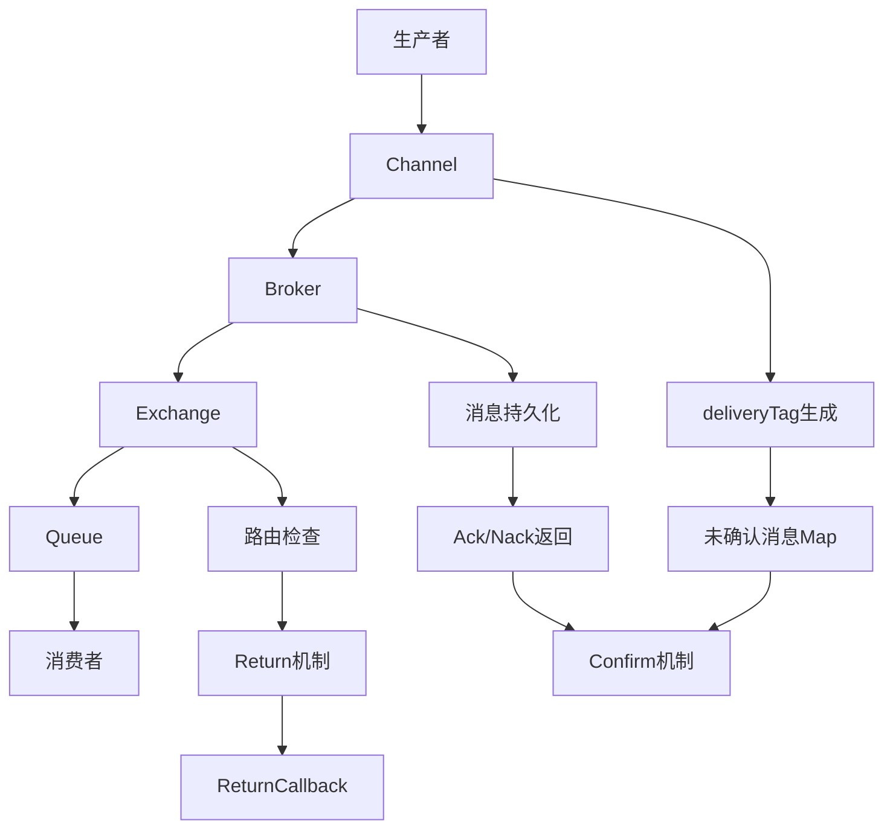

# RabbitMQ 生产者可靠性与确认机制全解析

在分布式系统中，消息队列作为解耦和异步处理的核心组件，其可靠性至关重要。本文将从生产者角度深入解析RabbitMQ的确认机制，包括Confirm机制、Return机制、同步异步模式对比，以及完整的代码实现和最佳实践。

---

## 目录

1. [为什么需要生产者确认机制](#为什么需要生产者确认机制)
2. [RabbitMQ 消息投递链路全景](#rabbitmq-消息投递链路全景)
3. [核心概念详解](#核心概念详解)
4. [生产者确认机制的原理](#生产者确认机制的原理)
5. [同步 Confirm 模式](#同步-confirm-模式)
6. [异步 Confirm 模式](#异步-confirm-模式)
7. [Return 机制](#return-机制)
8. [publisher-confirm-type 配置](#publisher-confirm-type-配置)
9. [生产者可靠性保障的全链路整合](#生产者可靠性保障的全链路整合)
10. [完整代码实现](#完整代码实现)
11. [最佳实践与总结](#最佳实践与总结)

---

## 为什么需要生产者确认机制

在消息队列的使用过程中，消费者消费确认（Consumer Ack）我们比较熟悉，它保证了消息不会"白白丢失"。

但往往被忽视的一点是：**生产者发送消息到 RabbitMQ Broker 的过程中，也可能丢失消息**。常见情况包括：

### 消息丢失场景

1. **网络瞬时中断**：消息没有到达 Broker
2. **Broker 收到消息，但尚未持久化就崩溃**
3. **Exchange 路由失败**：消息没有进入任何队列
4. **内存不足**：Broker 内存溢出导致消息丢失
5. **磁盘故障**：持久化消息时磁盘写入失败

### 问题代码示例（不可靠实现）

```java
// ❌ 错误实现：没有确认机制，消息可能丢失
@Service
public class UnreliableMessageProducer {
    
    @Autowired
    private RabbitTemplate rabbitTemplate;
    
    public void sendMessage(String message) {
        // 直接发送，不知道是否成功
        rabbitTemplate.convertAndSend("exchange", "routingKey", message);
        System.out.println("消息已发送"); // 这里可能消息已经丢失了！
    }
}
```

### 可靠实现对比

```java
// ✅ 正确实现：带确认机制
@Service
public class ReliableMessageProducer {
    
    @Autowired
    private RabbitTemplate rabbitTemplate;
    
    public void sendMessage(String message) {
        try {
            // 开启确认模式
            rabbitTemplate.setConfirmCallback((correlationData, ack, cause) -> {
                if (ack) {
                    System.out.println("消息投递成功");
                } else {
                    System.out.println("消息投递失败: " + cause);
                }
            });
            
            rabbitTemplate.convertAndSend("exchange", "routingKey", message);
        } catch (Exception e) {
            System.err.println("发送消息异常: " + e.getMessage());
        }
    }
}
```

如果没有可靠的确认机制，生产者会认为消息已经成功投递，但实际上消息可能在半路丢了。

因此，RabbitMQ 提供了 **Publisher Confirms 和 Return 机制** 来保证生产者侧的可靠性。

---

## RabbitMQ 消息投递链路全景

让我们从整体链路看一次消息从生产者到消费者的生命周期：

### 完整投递链路



### 详细流程说明

1. **生产者调用 channel.basicPublish**
   - 将消息通过 Channel 发送到 Broker
   - 同时，Channel 内部会为该消息生成一个 **递增的 deliveryTag**
   - 把它放到一个"未确认消息 Map"中（仅在开启 Confirm 模式时）

2. **Broker 收到消息**
   - 根据 BasicProperties（包括持久化标志）尝试存储消息
   - 将消息路由到对应的 Exchange → Queue
   - 如果存储成功，Broker 会准备返回 Ack；如果失败，返回 Nack

3. **Broker → 生产者**
   - Broker 通过 AMQP 协议返回一条 Confirm 消息帧（包含 deliveryTag、ack/nack、multiple）
   - 生产者的 Channel 收到后，触发内部 Confirm 处理逻辑

4. **ConfirmListener 回调**
   - Channel 从"未确认 Map"中找到对应 deliveryTag 的消息
   - 移除它，并调用生产者注册的 Confirm 回调函数（异步模式）或让阻塞的同步方法返回

5. **Return 机制（可选）**
   - 如果 basicPublish 时指定了 mandatory=true，且消息未能路由到任何队列
   - Broker 会返回 Basic.Return 消息帧
   - 生产者通过 ReturnCallback 接收该事件，决定是否重试或丢弃

这一过程确保了 **生产者可以明确知道消息是成功投递到 Broker 还是失败**，避免了"黑箱发送"。

---

## 核心概念详解

### 1. Broker

RabbitMQ 服务器本身就是一个 Broker，负责接收、存储、路由和投递消息。

```java
// Broker 连接配置
@Configuration
public class RabbitMQConfig {
    
    @Bean
    public ConnectionFactory connectionFactory() {
        CachingConnectionFactory factory = new CachingConnectionFactory();
        factory.setHost("localhost");
        factory.setPort(5672);
        factory.setUsername("guest");
        factory.setPassword("guest");
        factory.setVirtualHost("/");
        
        // 开启确认模式
        factory.setPublisherConfirmType(CachingConnectionFactory.ConfirmType.CORRELATED);
        factory.setPublisherReturns(true);
        
        return factory;
    }
}
```

### 2. Connection

生产者与 Broker 建立的 TCP 长连接。

```java
@Component
public class ConnectionManager {
    
    @Autowired
    private ConnectionFactory connectionFactory;
    
    private Connection connection;
    
    @PostConstruct
    public void initConnection() {
        try {
            connection = connectionFactory.newConnection();
            System.out.println("连接建立成功");
        } catch (Exception e) {
            System.err.println("连接建立失败: " + e.getMessage());
        }
    }
    
    @PreDestroy
    public void closeConnection() {
        if (connection != null && connection.isOpen()) {
            try {
                connection.close();
                System.out.println("连接已关闭");
            } catch (Exception e) {
                System.err.println("关闭连接异常: " + e.getMessage());
            }
        }
    }
}
```

### 3. Channel

在 Connection 上的逻辑通道。

- 消息的发送、确认都通过 Channel 完成
- ConfirmListener 绑定在 Channel 上
- deliveryTag 也是以 Channel 为作用域生成的

```java
@Service
public class ChannelManager {
    
    @Autowired
    private ConnectionFactory connectionFactory;
    
    private Channel channel;
    
    public Channel getChannel() throws IOException {
        if (channel == null || !channel.isOpen()) {
            Connection connection = connectionFactory.newConnection();
            channel = connection.createChannel();
            
            // 开启确认模式
            channel.confirmSelect();
        }
        return channel;
    }
}
```

### 4. Exchange

消息路由器。生产者只能把消息投递到 Exchange，由 Exchange 根据类型（Direct/Topic/Fanout/Headers）和 Binding 规则路由到 Queue。

```java
@Component
public class ExchangeConfig {
    
    @Bean
    public DirectExchange directExchange() {
        return new DirectExchange("direct.exchange", true, false);
    }
    
    @Bean
    public TopicExchange topicExchange() {
        return new TopicExchange("topic.exchange", true, false);
    }
    
    @Bean
    public FanoutExchange fanoutExchange() {
        return new FanoutExchange("fanout.exchange", true, false);
    }
}
```

### 5. Queue

消息的存储容器，等待消费者消费。

```java
@Component
public class QueueConfig {
    
    @Bean
    public Queue reliableQueue() {
        return QueueBuilder.durable("reliable.queue")
                .withArgument("x-message-ttl", 60000) // 消息TTL
                .withArgument("x-max-length", 1000)   // 队列最大长度
                .build();
    }
    
    @Bean
    public Queue deadLetterQueue() {
        return QueueBuilder.durable("dead.letter.queue").build();
    }
}
```

### 6. Binding

Exchange 与 Queue 的绑定关系，决定消息的流向。

```java
@Component
public class BindingConfig {
    
    @Bean
    public Binding reliableBinding() {
        return BindingBuilder
                .bind(reliableQueue())
                .to(directExchange())
                .with("reliable.key");
    }
}
```

### 7. Basic.Publish

AMQP 协议中的消息发送命令。调用 channel.basicPublish 就是向 Broker 发送 Basic.Publish 指令，附带消息体和属性。

---

## 生产者确认机制的原理

### deliveryTag

- 每个 Channel 内部会维护一个 **递增的计数器**
- 每调用一次 basicPublish，这个计数器加 1，得到一个 deliveryTag
- deliveryTag 作为消息的"唯一序号"，用于后续 Ack/Nack 对应

```java
// deliveryTag 生成示例
public class DeliveryTagGenerator {
    
    private final AtomicLong deliveryTagCounter = new AtomicLong(0);
    
    public long generateDeliveryTag() {
        return deliveryTagCounter.incrementAndGet();
    }
    
    public void reset() {
        deliveryTagCounter.set(0);
    }
}
```

### 未确认消息 Map

- Channel 内部保存一个 **有序 Map**，key 是 deliveryTag，value 是消息信息
- 只有在开启 Confirm 模式后，这个 Map 才会启用
- Ack/Nack 到来时，Channel 会查 Map 来找到需要确认的消息

```java
// 未确认消息管理
public class UnconfirmedMessageManager {
    
    private final Map<Long, UnconfirmedMessage> unconfirmedMessages = new ConcurrentHashMap<>();
    
    public void addUnconfirmedMessage(long deliveryTag, UnconfirmedMessage message) {
        unconfirmedMessages.put(deliveryTag, message);
    }
    
    public UnconfirmedMessage removeUnconfirmedMessage(long deliveryTag) {
        return unconfirmedMessages.remove(deliveryTag);
    }
    
    public void removeMultipleMessages(long deliveryTag) {
        unconfirmedMessages.entrySet().removeIf(entry -> entry.getKey() <= deliveryTag);
    }
    
    public int getUnconfirmedCount() {
        return unconfirmedMessages.size();
    }
}

@Data
@AllArgsConstructor
public class UnconfirmedMessage {
    private String exchange;
    private String routingKey;
    private byte[] body;
    private long timestamp;
}
```

### multiple 标志位

- Ack/Nack 消息中带有 multiple 布尔值
- **false**：只确认当前 deliveryTag
- **true**：确认 **小于等于当前 deliveryTag 的所有消息**

这是一种批量确认机制，可以减少网络交互。

```java
// multiple 标志位处理
public class MultipleConfirmHandler {
    
    public void handleConfirm(long deliveryTag, boolean multiple, boolean ack) {
        if (multiple) {
            // 批量确认：确认所有小于等于 deliveryTag 的消息
            handleMultipleConfirm(deliveryTag, ack);
        } else {
            // 单个确认：只确认当前 deliveryTag
            handleSingleConfirm(deliveryTag, ack);
        }
    }
    
    private void handleMultipleConfirm(long deliveryTag, boolean ack) {
        // 处理批量确认逻辑
        System.out.println("批量确认 deliveryTag: " + deliveryTag + ", ack: " + ack);
    }
    
    private void handleSingleConfirm(long deliveryTag, boolean ack) {
        // 处理单个确认逻辑
        System.out.println("单个确认 deliveryTag: " + deliveryTag + ", ack: " + ack);
    }
}
```

### Ack/Nack 触发时机

- **Ack**：消息持久化成功，或投递到队列成功
- **Nack**：存储失败、Broker 内部异常

---

## 同步 Confirm 模式

### 实现方式

1. 调用 `channel.confirmSelect()` 开启 Confirm 模式
2. 每次 `basicPublish` 之后调用 `channel.waitForConfirms()` 阻塞等待

### 示例代码

```java
@Service
public class SynchronousConfirmProducer {
    
    @Autowired
    private ConnectionFactory connectionFactory;
    
    public void sendMessageWithSyncConfirm(String exchange, String routingKey, String message) {
        Connection connection = null;
        Channel channel = null;
        
        try {
            // 1. 建立连接和通道
            connection = connectionFactory.newConnection();
            channel = connection.createChannel();
            
            // 2. 开启确认模式
            channel.confirmSelect();
            
            // 3. 发送消息
            channel.basicPublish(exchange, routingKey, null, message.getBytes());
            
            // 4. 同步等待确认
            boolean confirmed = channel.waitForConfirms(5000); // 5秒超时
            
            if (confirmed) {
                System.out.println("消息投递成功: " + message);
            } else {
                System.out.println("消息投递失败: " + message);
            }
            
        } catch (Exception e) {
            System.err.println("发送消息异常: " + e.getMessage());
        } finally {
            // 5. 关闭资源
            closeResources(channel, connection);
        }
    }
    
    public void sendMultipleMessagesWithSyncConfirm(String exchange, String routingKey, List<String> messages) {
        Connection connection = null;
        Channel channel = null;
        
        try {
            connection = connectionFactory.newConnection();
            channel = connection.createChannel();
            channel.confirmSelect();
            
            // 批量发送消息
            for (String message : messages) {
                channel.basicPublish(exchange, routingKey, null, message.getBytes());
            }
            
            // 批量等待确认
            boolean confirmed = channel.waitForConfirms(10000); // 10秒超时
            
            if (confirmed) {
                System.out.println("批量消息投递成功，数量: " + messages.size());
            } else {
                System.out.println("批量消息投递失败");
            }
            
        } catch (Exception e) {
            System.err.println("批量发送消息异常: " + e.getMessage());
        } finally {
            closeResources(channel, connection);
        }
    }
    
    private void closeResources(Channel channel, Connection connection) {
        try {
            if (channel != null && channel.isOpen()) {
                channel.close();
            }
            if (connection != null && connection.isOpen()) {
                connection.close();
            }
        } catch (Exception e) {
            System.err.println("关闭资源异常: " + e.getMessage());
        }
    }
}
```

### 特点

- **优点**：简单易懂，实时知道结果
- **缺点**：性能差，因为每条消息都要阻塞等待
- **适用场景**：低吞吐、强一致场景

---

## 异步 Confirm 模式

### 实现方式

1. 调用 `channel.confirmSelect()` 开启 Confirm 模式
2. 注册 `ConfirmListener`
3. 调用 `basicPublish` 时不阻塞，依赖异步回调处理 Ack/Nack

### 示例代码

```java
@Service
public class AsynchronousConfirmProducer {
    
    @Autowired
    private ConnectionFactory connectionFactory;
    
    private final Map<Long, UnconfirmedMessage> unconfirmedMessages = new ConcurrentHashMap<>();
    private final AtomicLong deliveryTagCounter = new AtomicLong(0);
    
    public void sendMessageWithAsyncConfirm(String exchange, String routingKey, String message) {
        Connection connection = null;
        Channel channel = null;
        
        try {
            connection = connectionFactory.newConnection();
            channel = connection.createChannel();
            channel.confirmSelect();
            
            // 注册异步确认监听器
            channel.addConfirmListener(
                (deliveryTag, multiple) -> { // ack 回调
                    handleAck(deliveryTag, multiple);
                },
                (deliveryTag, multiple) -> { // nack 回调
                    handleNack(deliveryTag, multiple);
                }
            );
            
            // 异步发送消息
            long deliveryTag = deliveryTagCounter.incrementAndGet();
            channel.basicPublish(exchange, routingKey, null, message.getBytes());
            
            // 记录未确认消息
            unconfirmedMessages.put(deliveryTag, new UnconfirmedMessage(
                exchange, routingKey, message.getBytes(), System.currentTimeMillis()
            ));
            
            System.out.println("消息已发送，等待确认: " + message);
            
        } catch (Exception e) {
            System.err.println("发送消息异常: " + e.getMessage());
        }
    }
    
    private void handleAck(long deliveryTag, boolean multiple) {
        if (multiple) {
            // 批量确认
            unconfirmedMessages.entrySet().removeIf(entry -> entry.getKey() <= deliveryTag);
            System.out.println("批量ACK，deliveryTag: " + deliveryTag);
        } else {
            // 单个确认
            UnconfirmedMessage message = unconfirmedMessages.remove(deliveryTag);
            if (message != null) {
                System.out.println("消息确认成功，deliveryTag: " + deliveryTag + 
                    ", message: " + new String(message.getBody()));
            }
        }
    }
    
    private void handleNack(long deliveryTag, boolean multiple) {
        if (multiple) {
            // 批量拒绝
            unconfirmedMessages.entrySet().removeIf(entry -> entry.getKey() <= deliveryTag);
            System.out.println("批量NACK，deliveryTag: " + deliveryTag);
        } else {
            // 单个拒绝
            UnconfirmedMessage message = unconfirmedMessages.remove(deliveryTag);
            if (message != null) {
                System.out.println("消息确认失败，deliveryTag: " + deliveryTag + 
                    ", message: " + new String(message.getBody()));
                // 这里可以实现重试逻辑
                retryMessage(message);
            }
        }
    }
    
    private void retryMessage(UnconfirmedMessage message) {
        // 实现重试逻辑
        System.out.println("重试消息: " + new String(message.getBody()));
    }
    
    public void sendMultipleMessagesWithAsyncConfirm(String exchange, String routingKey, List<String> messages) {
        Connection connection = null;
        Channel channel = null;
        
        try {
            connection = connectionFactory.newConnection();
            channel = connection.createChannel();
            channel.confirmSelect();
            
            // 注册确认监听器
            channel.addConfirmListener(
                (deliveryTag, multiple) -> handleAck(deliveryTag, multiple),
                (deliveryTag, multiple) -> handleNack(deliveryTag, multiple)
            );
            
            // 批量发送消息
            for (String message : messages) {
                long deliveryTag = deliveryTagCounter.incrementAndGet();
                channel.basicPublish(exchange, routingKey, null, message.getBytes());
                
                unconfirmedMessages.put(deliveryTag, new UnconfirmedMessage(
                    exchange, routingKey, message.getBytes(), System.currentTimeMillis()
                ));
            }
            
            System.out.println("批量消息已发送，数量: " + messages.size());
            
        } catch (Exception e) {
            System.err.println("批量发送消息异常: " + e.getMessage());
        }
    }
}
```

### 异步的原理

1. **发送消息时**：消息立即放入未确认 Map
2. **Broker 在后台异步返回 Confirm 帧**
3. **Channel 内部的 IO 线程解析 Confirm 帧**，找到 deliveryTag 对应的消息，从 Map 移除，并触发回调

### 与同步的对比

| 特性 | 同步 Confirm | 异步 Confirm |
|------|-------------|-------------|
| **性能** | 低（阻塞等待） | 高（非阻塞） |
| **吞吐量** | 低 | 高 |
| **实时性** | 实时知道结果 | 通过回调异步处理 |
| **复杂度** | 简单 | 相对复杂 |
| **适用场景** | 低并发、强一致 | 高并发、高吞吐 |

---

## Return 机制

### 背景

即使消息到达了 Broker，如果 Exchange 无法将消息路由到任何队列，该消息就会被丢弃。

为避免无声丢失，可以开启 Return 机制。

### Mandatory 标志

```java
// mandatory 参数说明
channel.basicPublish(exchange, routingKey, mandatory, props, body);
```

- **mandatory=false**：路由失败时，Broker 丢弃消息
- **mandatory=true**：路由失败时，Broker 通过 Basic.Return 返回消息给生产者

### ReturnCallback 实现

```java
@Service
public class ReturnCallbackProducer {
    
    @Autowired
    private ConnectionFactory connectionFactory;
    
    public void sendMessageWithReturnCallback(String exchange, String routingKey, String message) {
        Connection connection = null;
        Channel channel = null;
        
        try {
            connection = connectionFactory.newConnection();
            channel = connection.createChannel();
            
            // 注册 Return 监听器
            channel.addReturnListener((replyCode, replyText, exchangeName, routingKeyName, properties, body) -> {
                System.out.println("消息无法路由，被退回:");
                System.out.println("  replyCode: " + replyCode);
                System.out.println("  replyText: " + replyText);
                System.out.println("  exchange: " + exchangeName);
                System.out.println("  routingKey: " + routingKeyName);
                System.out.println("  message: " + new String(body));
                
                // 处理退回的消息
                handleReturnedMessage(replyCode, replyText, exchangeName, routingKeyName, body);
            });
            
            // 发送消息，设置 mandatory=true
            channel.basicPublish(exchange, routingKey, true, null, message.getBytes());
            
            System.out.println("消息已发送，等待路由结果: " + message);
            
        } catch (Exception e) {
            System.err.println("发送消息异常: " + e.getMessage());
        }
    }
    
    private void handleReturnedMessage(int replyCode, String replyText, String exchange, String routingKey, byte[] body) {
        // 根据不同的错误码处理退回消息
        switch (replyCode) {
            case 312: // NO_ROUTE
                System.out.println("没有找到匹配的队列，消息被退回");
                // 可以实现重试或记录日志
                break;
            case 313: // NO_CONSUMERS
                System.out.println("没有消费者，消息被退回");
                break;
            default:
                System.out.println("未知错误，消息被退回: " + replyCode);
        }
    }
}
```

### 与 Confirm 的区别

| 机制 | 作用 | 触发时机 |
|------|------|----------|
| **Confirm** | 确认消息是否进入 Broker | 消息到达 Broker 后 |
| **Return** | 确认消息是否被路由到队列 | 消息无法路由到队列时 |
| **组合使用** | 完整覆盖生产者可靠性 | 两者结合，才能完整覆盖 |

---

## publisher-confirm-type 配置

在 Spring AMQP 中，常见配置是：

```yaml
spring:
  rabbitmq:
    publisher-confirm-type: correlated
    publisher-returns: true
```

### 类型说明

| 类型 | 说明 | 使用场景 |
|------|------|----------|
| **none** | 关闭 confirm | 性能优先，可靠性要求不高 |
| **simple** | 同步阻塞等待确认 | 低并发，强一致性要求 |
| **correlated** | 异步回调确认（推荐） | 高并发，高吞吐量 |

### Spring AMQP 配置类

```java
@Configuration
@EnableRabbit
public class RabbitMQConfig {
    
    @Bean
    public CachingConnectionFactory connectionFactory() {
        CachingConnectionFactory factory = new CachingConnectionFactory();
        factory.setHost("localhost");
        factory.setPort(5672);
        factory.setUsername("guest");
        factory.setPassword("guest");
        factory.setVirtualHost("/");
        
        // 开启确认模式
        factory.setPublisherConfirmType(CachingConnectionFactory.ConfirmType.CORRELATED);
        factory.setPublisherReturns(true);
        
        return factory;
    }
    
    @Bean
    public RabbitTemplate rabbitTemplate(CachingConnectionFactory connectionFactory) {
        RabbitTemplate template = new RabbitTemplate(connectionFactory);
        
        // 设置确认回调
        template.setConfirmCallback((correlationData, ack, cause) -> {
            if (ack) {
                System.out.println("消息投递成功: " + correlationData);
            } else {
                System.out.println("消息投递失败: " + cause);
            }
        });
        
        // 设置返回回调
        template.setReturnCallback((message, replyCode, replyText, exchange, routingKey) -> {
            System.out.println("消息被退回:");
            System.out.println("  replyCode: " + replyCode);
            System.out.println("  replyText: " + replyText);
            System.out.println("  exchange: " + exchange);
            System.out.println("  routingKey: " + routingKey);
            System.out.println("  message: " + new String(message.getBody()));
        });
        
        return template;
    }
}
```

### 与异步 Confirm 的关系

`correlated` 实际上就是使用 RabbitMQ 的 **异步 ConfirmListener**；

Spring 封装了 `ConfirmCallback` 接口，把 deliveryTag 与消息关联起来，便于开发。

---

## 生产者可靠性保障的全链路整合

完整的可靠性链路通常需要：

### 1. Confirm + Return 组合

```java
@Service
public class ReliableMessageProducer {
    
    @Autowired
    private RabbitTemplate rabbitTemplate;
    
    public void sendReliableMessage(String exchange, String routingKey, String message) {
        try {
            // 设置消息属性
            MessageProperties properties = new MessageProperties();
            properties.setDeliveryMode(MessageDeliveryMode.PERSISTENT); // 持久化
            properties.setMessageId(UUID.randomUUID().toString());
            properties.setTimestamp(new Date());
            
            Message messageObj = new Message(message.getBytes(), properties);
            
            // 发送消息
            rabbitTemplate.convertAndSend(exchange, routingKey, messageObj);
            
            System.out.println("可靠消息已发送: " + message);
            
        } catch (Exception e) {
            System.err.println("发送可靠消息异常: " + e.getMessage());
            // 实现重试逻辑
            retryMessage(exchange, routingKey, message);
        }
    }
    
    private void retryMessage(String exchange, String routingKey, String message) {
        // 实现重试逻辑
        System.out.println("重试发送消息: " + message);
    }
}
```

### 2. 幂等性与消息去重

```java
@Service
public class IdempotentMessageProducer {
    
    @Autowired
    private RedisTemplate<String, Object> redisTemplate;
    
    @Autowired
    private RabbitTemplate rabbitTemplate;
    
    public void sendIdempotentMessage(String exchange, String routingKey, String message, String messageId) {
        try {
            // 检查消息是否已发送
            String key = "message:" + messageId;
            if (redisTemplate.hasKey(key)) {
                System.out.println("消息已发送，跳过重复发送: " + messageId);
                return;
            }
            
            // 发送消息
            rabbitTemplate.convertAndSend(exchange, routingKey, message);
            
            // 记录消息ID，设置过期时间
            redisTemplate.opsForValue().set(key, "sent", Duration.ofHours(24));
            
            System.out.println("幂等消息已发送: " + messageId);
            
        } catch (Exception e) {
            System.err.println("发送幂等消息异常: " + e.getMessage());
        }
    }
}
```

### 3. 消息持久化与磁盘写入

```java
@Component
public class PersistentMessageConfig {
    
    @Bean
    public DirectExchange persistentExchange() {
        return new DirectExchange("persistent.exchange", true, false);
    }
    
    @Bean
    public Queue persistentQueue() {
        return QueueBuilder.durable("persistent.queue")
                .withArgument("x-message-ttl", 60000)
                .build();
    }
    
    @Bean
    public Binding persistentBinding() {
        return BindingBuilder
                .bind(persistentQueue())
                .to(persistentExchange())
                .with("persistent.key");
    }
}
```

### 4. 应用层补偿机制

```java
@Service
public class CompensatingMessageProducer {
    
    @Autowired
    private RabbitTemplate rabbitTemplate;
    
    @Autowired
    private RedisTemplate<String, Object> redisTemplate;
    
    private final Map<String, UnconfirmedMessage> unconfirmedMessages = new ConcurrentHashMap<>();
    
    @Scheduled(fixedRate = 30000) // 30秒检查一次
    public void checkUnconfirmedMessages() {
        long currentTime = System.currentTimeMillis();
        
        unconfirmedMessages.entrySet().removeIf(entry -> {
            UnconfirmedMessage message = entry.getValue();
            if (currentTime - message.getTimestamp() > 60000) { // 1分钟超时
                System.out.println("消息超时未确认，准备重发: " + entry.getKey());
                retryMessage(message);
                return true;
            }
            return false;
        });
    }
    
    private void retryMessage(UnconfirmedMessage message) {
        try {
            rabbitTemplate.convertAndSend(
                message.getExchange(), 
                message.getRoutingKey(), 
                new String(message.getBody())
            );
            System.out.println("消息重发成功: " + new String(message.getBody()));
        } catch (Exception e) {
            System.err.println("消息重发失败: " + e.getMessage());
        }
    }
}
```

---

## 完整代码实现

### 项目结构

```
rabbitmq-reliability/
├── src/main/java/com/reliability/
│   ├── config/
│   │   ├── RabbitMQConfig.java
│   │   └── MessageConfig.java
│   ├── producer/
│   │   ├── ReliableMessageProducer.java
│   │   ├── AsyncConfirmProducer.java
│   │   └── SyncConfirmProducer.java
│   ├── consumer/
│   │   └── ReliableMessageConsumer.java
│   ├── entity/
│   │   └── UnconfirmedMessage.java
│   ├── service/
│   │   └── MessageReliabilityService.java
│   └── util/
│       └── MessageUtils.java
```

### 核心配置类

```java
@Configuration
@EnableRabbit
@Slf4j
public class RabbitMQConfig {
    
    @Bean
    public CachingConnectionFactory connectionFactory() {
        CachingConnectionFactory factory = new CachingConnectionFactory();
        factory.setHost("localhost");
        factory.setPort(5672);
        factory.setUsername("guest");
        factory.setPassword("guest");
        factory.setVirtualHost("/");
        
        // 连接池配置
        factory.setChannelCacheSize(50);
        factory.setChannelCheckoutTimeout(10000);
        
        // 开启确认模式
        factory.setPublisherConfirmType(CachingConnectionFactory.ConfirmType.CORRELATED);
        factory.setPublisherReturns(true);
        
        return factory;
    }
    
    @Bean
    public RabbitTemplate rabbitTemplate(CachingConnectionFactory connectionFactory) {
        RabbitTemplate template = new RabbitTemplate(connectionFactory);
        
        // 设置确认回调
        template.setConfirmCallback((correlationData, ack, cause) -> {
            if (ack) {
                log.info("消息投递成功: {}", correlationData);
            } else {
                log.error("消息投递失败: {}, cause: {}", correlationData, cause);
            }
        });
        
        // 设置返回回调
        template.setReturnCallback((message, replyCode, replyText, exchange, routingKey) -> {
            log.warn("消息被退回: replyCode={}, replyText={}, exchange={}, routingKey={}", 
                replyCode, replyText, exchange, routingKey);
        });
        
        return template;
    }
    
    // 交换机配置
    @Bean
    public DirectExchange reliableExchange() {
        return new DirectExchange("reliable.exchange", true, false);
    }
    
    @Bean
    public Queue reliableQueue() {
        return QueueBuilder.durable("reliable.queue")
                .withArgument("x-message-ttl", 300000) // 5分钟TTL
                .withArgument("x-max-length", 10000)   // 最大长度
                .build();
    }
    
    @Bean
    public Binding reliableBinding() {
        return BindingBuilder
                .bind(reliableQueue())
                .to(reliableExchange())
                .with("reliable.key");
    }
}
```

### 可靠消息生产者

```java
@Service
@Slf4j
public class ReliableMessageProducer {
    
    @Autowired
    private RabbitTemplate rabbitTemplate;
    
    @Autowired
    private RedisTemplate<String, Object> redisTemplate;
    
    private final Map<String, UnconfirmedMessage> unconfirmedMessages = new ConcurrentHashMap<>();
    
    /**
     * 发送可靠消息
     */
    public void sendReliableMessage(String message, String messageId) {
        try {
            // 1. 检查消息是否已发送（幂等性）
            if (isMessageAlreadySent(messageId)) {
                log.warn("消息已发送，跳过重复发送: {}", messageId);
                return;
            }
            
            // 2. 构建消息
            MessageProperties properties = new MessageProperties();
            properties.setDeliveryMode(MessageDeliveryMode.PERSISTENT);
            properties.setMessageId(messageId);
            properties.setTimestamp(new Date());
            properties.setContentType("application/json");
            
            Message messageObj = new Message(message.getBytes(), properties);
            
            // 3. 记录未确认消息
            UnconfirmedMessage unconfirmedMessage = new UnconfirmedMessage(
                "reliable.exchange", "reliable.key", message.getBytes(), System.currentTimeMillis()
            );
            unconfirmedMessages.put(messageId, unconfirmedMessage);
            
            // 4. 发送消息
            rabbitTemplate.convertAndSend("reliable.exchange", "reliable.key", messageObj);
            
            // 5. 记录消息ID到Redis
            recordMessageId(messageId);
            
            log.info("可靠消息已发送: {}", messageId);
            
        } catch (Exception e) {
            log.error("发送可靠消息异常: {}", e.getMessage(), e);
            // 实现重试逻辑
            retryMessage(message, messageId);
        }
    }
    
    /**
     * 批量发送可靠消息
     */
    public void sendBatchReliableMessages(List<String> messages) {
        for (int i = 0; i < messages.size(); i++) {
            String messageId = "batch_" + System.currentTimeMillis() + "_" + i;
            sendReliableMessage(messages.get(i), messageId);
        }
    }
    
    /**
     * 检查消息是否已发送
     */
    private boolean isMessageAlreadySent(String messageId) {
        String key = "message:" + messageId;
        return redisTemplate.hasKey(key);
    }
    
    /**
     * 记录消息ID
     */
    private void recordMessageId(String messageId) {
        String key = "message:" + messageId;
        redisTemplate.opsForValue().set(key, "sent", Duration.ofHours(24));
    }
    
    /**
     * 重试消息
     */
    private void retryMessage(String message, String messageId) {
        try {
            Thread.sleep(1000); // 等待1秒
            sendReliableMessage(message, messageId + "_retry");
            log.info("消息重试成功: {}", messageId);
        } catch (Exception e) {
            log.error("消息重试失败: {}", e.getMessage(), e);
        }
    }
    
    /**
     * 获取未确认消息数量
     */
    public int getUnconfirmedCount() {
        return unconfirmedMessages.size();
    }
    
    /**
     * 清理已确认消息
     */
    public void removeConfirmedMessage(String messageId) {
        unconfirmedMessages.remove(messageId);
    }
}
```

### 消息消费者

```java
@Component
@Slf4j
public class ReliableMessageConsumer {
    
    @Autowired
    private ReliableMessageProducer messageProducer;
    
    @RabbitListener(queues = "reliable.queue")
    public void handleReliableMessage(Message message, Channel channel, 
                                    @Header(AmqpHeaders.DELIVERY_TAG) long deliveryTag) {
        try {
            String messageId = message.getMessageProperties().getMessageId();
            String messageBody = new String(message.getBody());
            
            log.info("收到可靠消息: messageId={}, body={}", messageId, messageBody);
            
            // 处理业务逻辑
            processMessage(messageBody);
            
            // 手动确认消息
            channel.basicAck(deliveryTag, false);
            
            // 从生产者中移除已确认消息
            messageProducer.removeConfirmedMessage(messageId);
            
            log.info("消息处理完成: {}", messageId);
            
        } catch (Exception e) {
            log.error("处理消息异常: {}", e.getMessage(), e);
            
            try {
                // 拒绝消息，不重新入队
                channel.basicNack(deliveryTag, false, false);
            } catch (IOException ioException) {
                log.error("拒绝消息异常: {}", ioException.getMessage(), ioException);
            }
        }
    }
    
    /**
     * 处理业务逻辑
     */
    private void processMessage(String messageBody) {
        // 模拟业务处理
        try {
            Thread.sleep(100);
            log.info("业务处理完成: {}", messageBody);
        } catch (InterruptedException e) {
            Thread.currentThread().interrupt();
            log.error("业务处理被中断: {}", e.getMessage(), e);
        }
    }
}
```

### 消息可靠性服务

```java
@Service
@Slf4j
public class MessageReliabilityService {
    
    @Autowired
    private ReliableMessageProducer messageProducer;
    
    @Autowired
    private RedisTemplate<String, Object> redisTemplate;
    
    /**
     * 检查未确认消息
     */
    @Scheduled(fixedRate = 30000) // 30秒检查一次
    public void checkUnconfirmedMessages() {
        int unconfirmedCount = messageProducer.getUnconfirmedCount();
        if (unconfirmedCount > 0) {
            log.warn("当前有 {} 条未确认消息", unconfirmedCount);
        }
    }
    
    /**
     * 清理过期的消息记录
     */
    @Scheduled(fixedRate = 3600000) // 1小时清理一次
    public void cleanupExpiredMessages() {
        try {
            Set<String> keys = redisTemplate.keys("message:*");
            if (keys != null && !keys.isEmpty()) {
                redisTemplate.delete(keys);
                log.info("清理过期消息记录: {} 条", keys.size());
            }
        } catch (Exception e) {
            log.error("清理过期消息记录异常: {}", e.getMessage(), e);
        }
    }
    
    /**
     * 获取消息统计信息
     */
    public Map<String, Object> getMessageStatistics() {
        Map<String, Object> stats = new HashMap<>();
        stats.put("unconfirmedCount", messageProducer.getUnconfirmedCount());
        stats.put("timestamp", System.currentTimeMillis());
        return stats;
    }
}
```

---

## 最佳实践与总结

### 1. 性能优化建议

```java
// 连接池配置优化
@Configuration
public class PerformanceConfig {
    
    @Bean
    public CachingConnectionFactory optimizedConnectionFactory() {
        CachingConnectionFactory factory = new CachingConnectionFactory();
        
        // 连接池配置
        factory.setChannelCacheSize(100); // 增加通道缓存
        factory.setChannelCheckoutTimeout(5000); // 减少超时时间
        
        // 确认模式配置
        factory.setPublisherConfirmType(CachingConnectionFactory.ConfirmType.CORRELATED);
        factory.setPublisherReturns(true);
        
        return factory;
    }
}
```

### 2. 监控和告警

```java
@Component
@Slf4j
public class MessageMonitor {
    
    @Autowired
    private ReliableMessageProducer messageProducer;
    
    private final AtomicLong successCount = new AtomicLong(0);
    private final AtomicLong failureCount = new AtomicLong(0);
    
    @EventListener
    public void handleMessageSuccess(MessageSuccessEvent event) {
        successCount.incrementAndGet();
        log.info("消息发送成功，总数: {}", successCount.get());
    }
    
    @EventListener
    public void handleMessageFailure(MessageFailureEvent event) {
        failureCount.incrementAndGet();
        log.error("消息发送失败，总数: {}", failureCount.get());
    }
    
    @Scheduled(fixedRate = 60000) // 每分钟统计一次
    public void logStatistics() {
        long success = successCount.get();
        long failure = failureCount.get();
        long total = success + failure;
        
        if (total > 0) {
            double successRate = (double) success / total * 100;
            log.info("消息发送统计 - 成功: {}, 失败: {}, 成功率: {:.2f}%", 
                success, failure, successRate);
        }
    }
}
```

### 3. 总结

#### Confirm 机制解决了"消息是否到达 Broker"的问题
- **同步模式**：简单但低效，适合低并发场景
- **异步模式**：高效且常用，适合高并发场景

#### Return 机制解决了"消息是否路由到队列"的问题
- 与 Confirm 机制结合使用
- 确保消息完整投递到目标队列

#### deliveryTag + multiple 构成了 Confirm 的核心逻辑
- **deliveryTag**：消息唯一标识
- **multiple**：批量确认机制
- **未确认消息Map**：管理待确认消息

#### Spring AMQP 的 publisher-confirm-type=correlated 就是异步 Confirm 的封装
- 简化了异步确认的使用
- 提供了统一的回调接口

#### 生产环境中，通常会 Confirm + Return + 消息持久化 + 应用层补偿 组合使用
- **Confirm机制**：确保消息到达Broker
- **Return机制**：确保消息路由到队列
- **消息持久化**：确保消息不丢失
- **应用层补偿**：处理异常情况
- **幂等性保证**：避免重复处理

通过本文的详细分析和完整代码实现，相信你已经对RabbitMQ生产者确认机制有了深入的理解。在实际项目中，要根据具体的业务需求和性能要求来选择合适的确认模式，并配合其他可靠性机制来构建真正可靠的消息投递系统。

---

*本文档详细介绍了RabbitMQ生产者确认机制的原理和实现，包含了完整的代码示例和最佳实践，帮助开发者构建可靠的消息投递系统。*
