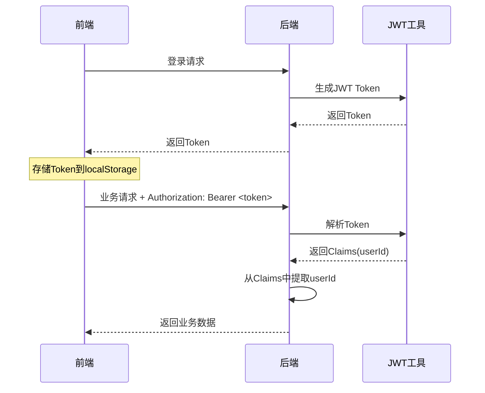
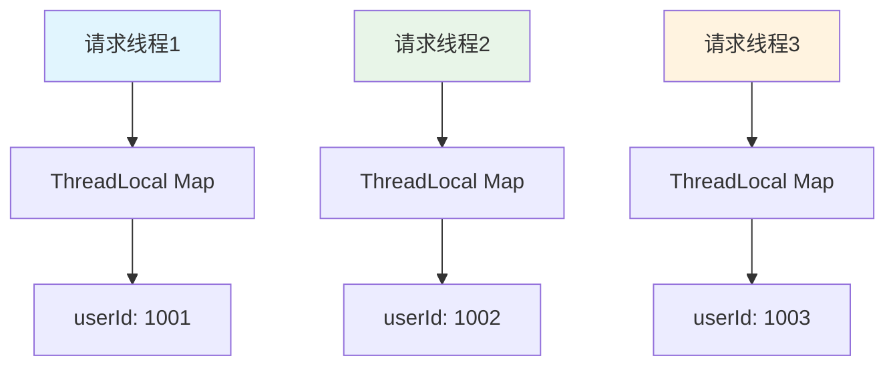
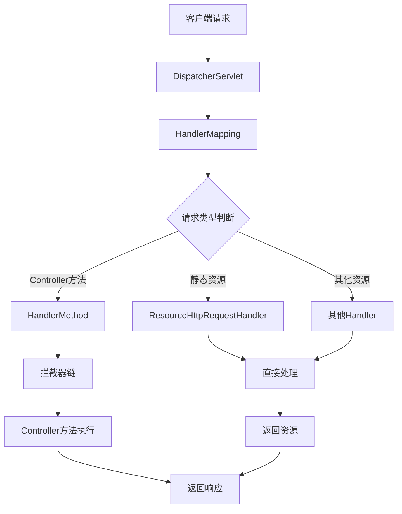
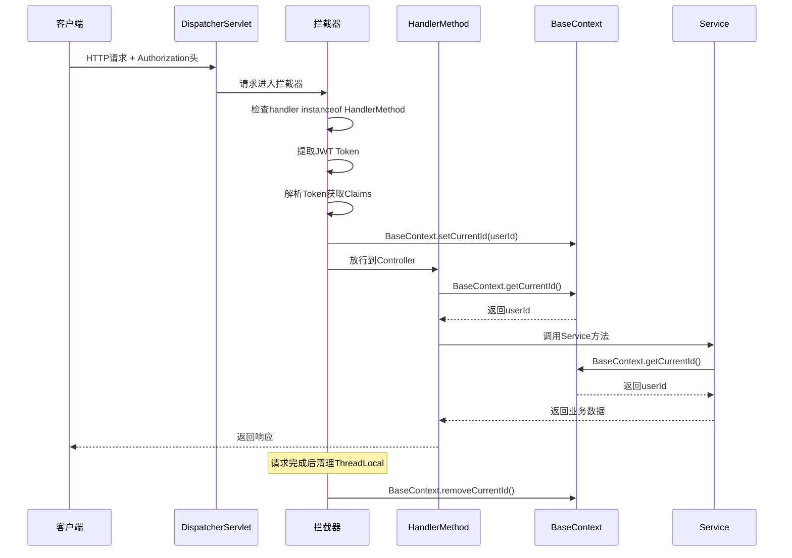

# Spring Boot JWT 与拦截器详解：BaseContext、HandlerMethod、HttpServletRequest 与 instanceof

在开发 Java Web 项目时，经常会用到 JWT 鉴权、拦截器以及请求上下文管理。本文结合一个咖啡购物车项目，详细讲解相关概念和代码实现。

## 📋 目录

- [HttpServletRequest 是什么？](#1-httpservletrequest-是什么)
- [Controller 方法为什么有时需要 HttpServletRequest？](#2-controller-方法为什么有时需要-httpservletrequest)
- [注释解析："从请求头中获取用户ID"](#3-注释解析从请求头中获取用户id)
- [JwtTokenUserInterceptor 拦截器详解](#4-jwttokenuserinterceptor-拦截器详解)
- [Long userId = Long.valueOf(claims.get("userId").toString()); 解析](#5-long-userid-longvalueofclaimsgetuseridtostring-解析)
- [BaseContext 是什么？](#6-basecontext-是什么)
- [判断 handler 是否是 Controller 方法](#7-判断-handler-是否是-controller-方法)
- [instanceof 是什么？](#8-instanceof-是什么)
- [完整项目实战](#9-完整项目实战)
- [最佳实践与注意事项](#10-最佳实践与注意事项)
- [总结与流程图示意](#11-总结与流程图示意)

## 1. HttpServletRequest 是什么？

`HttpServletRequest` 是 Java Servlet API 提供的接口，用来封装客户端发给服务器的请求信息。

### 🔧 核心功能

```java
// 获取请求方式、路径
request.getMethod()       // GET / POST
request.getRequestURI()   // /cart/list

// 获取请求头
request.getHeader("Authorization")
request.getHeader("User-Agent")

// 获取请求参数
request.getParameter("name")
request.getParameterMap()

// 获取请求体（POST JSON 或表单）
request.getReader()

// 获取客户端信息
request.getRemoteAddr()  // IP地址
request.getHeader("User-Agent") // 浏览器信息

// 获取会话信息
request.getSession()
```

### 💡 实际应用场景

在我们的咖啡项目中，`HttpServletRequest` 主要用于：

1. **JWT Token 获取**：从 `Authorization` 请求头中提取 JWT Token
2. **用户身份识别**：解析 Token 获取用户 ID
3. **请求日志记录**：记录客户端 IP、User-Agent 等信息
4. **跨域处理**：获取 Origin 请求头进行跨域验证

## 2. Controller 方法为什么有时需要 HttpServletRequest？

### ✅ 不需要 HttpServletRequest 的情况

```java
@RestController
@RequestMapping("/products")
public class ProductController {
    
    // 只需要业务参数，Spring 自动绑定
    @GetMapping("/{id}")
    public Result<Product> getProduct(@PathVariable Long id) {
        return productService.getById(id);
    }
    
    @PostMapping
    public Result<String> createProduct(@RequestBody ProductDTO productDTO) {
        return productService.create(productDTO);
    }
}
```

### ❌ 需要 HttpServletRequest 的情况

```java
@RestController
@RequestMapping("/user")
public class UserController {
    
    @Autowired
    private JwtProperties jwtProperties;
    
    /**
     * 需要获取当前登录用户信息
     */
    @GetMapping("/profile")
    public Result<UserProfile> getProfile(HttpServletRequest request) {
        // 从请求头中获取用户ID
        Long userId = getCurrentUserId(request);
        return userService.getProfile(userId);
    }
    
    /**
     * 从请求中获取当前用户ID
     */
    private Long getCurrentUserId(HttpServletRequest request) {
        String token = request.getHeader("Authorization");
        if (token != null && token.startsWith("Bearer ")) {
            token = token.substring(7);
        }
        
        try {
            Claims claims = JwtUtil.parseJWT(jwtProperties.getUserSecretKey(), token);
            return Long.valueOf(claims.get("userId").toString());
        } catch (Exception e) {
            log.error("解析token失败", e);
            throw new RuntimeException("无效的token");
        }
    }
}
```

### 🎯 使用场景总结

| 场景 | 是否需要 HttpServletRequest | 原因 |
|------|---------------------------|------|
| 获取请求头信息 | ✅ 需要 | 如 JWT Token、User-Agent |
| 获取客户端 IP | ✅ 需要 | 安全审计、限流 |
| 获取 Session 信息 | ✅ 需要 | 会话管理 |
| 获取 Cookie | ✅ 需要 | 状态保持 |
| 纯业务参数处理 | ❌ 不需要 | Spring 自动绑定 |

## 3. 注释解析："从请求头中获取用户ID"

### 📝 注释含义解析

```java
// 从请求头中获取用户ID（这里需要根据你的JWT实现来获取）
```

这个注释的含义是：

1. **用户登录流程**：用户登录后，前端会拿到一个 JWT Token
2. **Token 传递**：前端每次请求时，将 Token 放在请求头中（`Authorization: Bearer <token>`）
3. **后端解析**：后端解析 JWT Token 获取 `userId`
4. **注释说明**：目前代码直接从请求头取 `userId`，在真实项目中要解析 JWT Token

### 🔄 完整流程示意



## 4. JwtTokenUserInterceptor 拦截器详解

### 🏗️ 完整拦截器实现

```java
@Component
@Slf4j
public class JwtTokenUserInterceptor implements HandlerInterceptor {
    
    @Autowired
    private JwtProperties jwtProperties;

    /**
     * 请求处理前的拦截逻辑
     */
    @Override
    public boolean preHandle(HttpServletRequest request, HttpServletResponse response, Object handler) throws Exception {
        // 1. 判断当前拦截到的是Controller的方法还是其他资源
        if (!(handler instanceof HandlerMethod)) {
            // 当前拦截到的不是动态方法，直接放行（静态资源等）
            return true;
        }

        // 2. 从请求头中获取令牌
        String token = request.getHeader(jwtProperties.getUserTokenName());
        log.info("请求头名称: {}", jwtProperties.getUserTokenName());
        log.info("Authorization头: {}", request.getHeader("Authorization"));

        // 3. 去掉Bearer前缀
        if (token != null && token.startsWith("Bearer ")) {
            token = token.substring(7);
        }

        // 4. 校验令牌
        try {
            log.info("JWT校验: {}", token);
            Claims claims = JwtUtil.parseJWT(jwtProperties.getUserSecretKey(), token);
            Long userId = Long.valueOf(claims.get("userId").toString());
            log.info("当前用户ID：{}", userId);
            
            // 5. 将用户ID存储到ThreadLocal中
            BaseContext.setCurrentId(userId);
            
            // 6. 通过，放行
            return true;
        } catch (Exception ex) {
            log.error("JWT校验失败: {}", ex.getMessage());
            // 7. 不通过，响应401状态码
            response.setStatus(401);
            return false;
        }
    }
}
```

### 🔍 代码逐行解析

#### 步骤1：判断请求类型
```java
if (!(handler instanceof HandlerMethod)) {
    return true; // 静态资源直接放行
}
```
- **目的**：区分 Controller 方法和静态资源请求
- **原理**：Spring MVC 中，每个请求都有一个 handler 来处理
- **HandlerMethod**：Controller 方法的处理器
- **ResourceHttpRequestHandler**：静态资源的处理器

#### 步骤2：获取 JWT Token
```java
String token = request.getHeader(jwtProperties.getUserTokenName());
```
- **配置化**：通过 `JwtProperties` 管理请求头名称
- **灵活性**：可以配置不同的请求头名称（如 `Authorization`、`X-Token` 等）

#### 步骤3：处理 Bearer 前缀
```java
if (token != null && token.startsWith("Bearer ")) {
    token = token.substring(7);
}
```
- **标准格式**：JWT Token 通常以 `Bearer ` 前缀传输
- **安全考虑**：明确标识 Token 类型，避免与其他认证方式混淆

#### 步骤4：JWT 解析与验证
```java
Claims claims = JwtUtil.parseJWT(jwtProperties.getUserSecretKey(), token);
Long userId = Long.valueOf(claims.get("userId").toString());
```
- **签名验证**：使用相同的密钥验证 Token 签名
- **过期检查**：JWT 库会自动检查 Token 是否过期
- **Claims 提取**：从 JWT 载荷中提取用户信息

#### 步骤5：上下文存储
```java
BaseContext.setCurrentId(userId);
```
- **ThreadLocal**：每个请求线程独立存储用户信息
- **避免传参**：Controller 和 Service 层可以直接获取当前用户 ID

## 5. Long userId = Long.valueOf(claims.get("userId").toString()); 解析

### 🔄 类型转换过程

```java
// 步骤分解
Object userIdObj = claims.get("userId");        // 1. 从Claims中获取userId（Object类型）
String userIdStr = userIdObj.toString();        // 2. 转成字符串
Long userId = Long.valueOf(userIdStr);          // 3. 转成Long对象
```

### ⚠️ 潜在问题与解决方案

#### 问题1：类型转换异常
```java
// 可能抛出 NumberFormatException
Long userId = Long.valueOf(claims.get("userId").toString());
```

**解决方案**：
```java
// 安全的类型转换
public static Long getUserIdSafely(Claims claims) {
    try {
        Object userIdObj = claims.get("userId");
        if (userIdObj == null) {
            throw new IllegalArgumentException("用户ID不能为空");
        }
        return Long.valueOf(userIdObj.toString());
    } catch (NumberFormatException e) {
        throw new IllegalArgumentException("用户ID格式错误: " + userIdObj);
    }
}
```

#### 问题2：空值处理
```java
// 检查空值
Object userIdObj = claims.get("userId");
if (userIdObj == null) {
    throw new IllegalArgumentException("JWT中缺少用户ID");
}
```

### 🎯 最佳实践

```java
/**
 * 安全地从Claims中获取用户ID
 */
private Long extractUserId(Claims claims) {
    Object userIdObj = claims.get("userId");
    if (userIdObj == null) {
        throw new IllegalArgumentException("JWT中缺少用户ID");
    }
    
    try {
        return Long.valueOf(userIdObj.toString());
    } catch (NumberFormatException e) {
        throw new IllegalArgumentException("用户ID格式错误: " + userIdObj);
    }
}
```

## 6. BaseContext 是什么？

### 🏗️ BaseContext 完整实现

```java
/**
 * 基于ThreadLocal封装工具类，用于保存和获取当前登录用户ID
 */
public class BaseContext {
    
    private static ThreadLocal<Long> threadLocal = new ThreadLocal<>();

    /**
     * 设置当前用户ID
     * @param id 用户ID
     */
    public static void setCurrentId(Long id) {
        threadLocal.set(id);
    }

    /**
     * 获取当前用户ID
     * @return 用户ID
     */
    public static Long getCurrentId() {
        return threadLocal.get();
    }

    /**
     * 删除当前用户ID（防止内存泄漏）
     */
    public static void removeCurrentId() {
        threadLocal.remove();
    }
}
```

### 🧵 ThreadLocal 原理

#### 为什么使用 ThreadLocal？

1. **线程隔离**：每个请求线程都有独立的用户信息存储
2. **避免传参**：不需要在每个方法中传递用户 ID
3. **代码简洁**：Controller 和 Service 层可以直接获取当前用户

#### ThreadLocal 内存模型



### 🔧 实际使用场景

#### Controller 层使用
```java
@RestController
@RequestMapping("/admin")
public class AdminController {
    
    @GetMapping("/info")
    public Result<AdminLoginVO> info() {
        // 直接获取当前登录管理员ID，无需传参
        Long adminId = BaseContext.getCurrentId();
        AdminLoginVO adminInfo = adminService.getById(adminId);
        return Result.success(adminInfo);
    }
}
```

#### Service 层使用
```java
@Service
public class OrderServiceImpl implements OrderService {
    
    @Override
    public Result<String> createOrder(OrderDTO orderDTO) {
        // 直接获取当前用户ID
        Long userId = BaseContext.getCurrentId();
        orderDTO.setUserId(userId);
        
        // 业务逻辑处理
        return processOrder(orderDTO);
    }
}
```

### ⚠️ 内存泄漏防护

#### 问题：ThreadLocal 内存泄漏
```java
// 错误示例：没有清理ThreadLocal
public void processRequest() {
    BaseContext.setCurrentId(1001L);
    // 处理业务逻辑
    // 忘记调用 removeCurrentId()
}
```

#### 解决方案：拦截器后处理
```java
@Component
@Slf4j
public class JwtTokenUserInterceptor implements HandlerInterceptor {
    
    @Override
    public boolean preHandle(HttpServletRequest request, HttpServletResponse response, Object handler) throws Exception {
        // JWT验证逻辑...
        BaseContext.setCurrentId(userId);
        return true;
    }
    
    @Override
    public void afterCompletion(HttpServletRequest request, HttpServletResponse response, Object handler, Exception ex) throws Exception {
        // 请求完成后清理ThreadLocal，防止内存泄漏
        BaseContext.removeCurrentId();
    }
}
```

## 7. 判断 handler 是否是 Controller 方法

### 🔍 HandlerMethod 详解

```java
if (!(handler instanceof HandlerMethod)) {
    return true; // 静态资源直接放行
}
```

#### Spring MVC 请求处理流程



#### HandlerMethod vs ResourceHttpRequestHandler

| 类型 | 用途 | 示例 |
|------|------|------|
| HandlerMethod | Controller 方法 | `@GetMapping("/users")` |
| ResourceHttpRequestHandler | 静态资源 | `/static/css/style.css` |
| RequestMappingHandlerMapping | 请求映射 | 默认的请求处理器 |

### 🎯 实际应用场景

#### 场景1：只拦截 Controller 方法
```java
@Override
public boolean preHandle(HttpServletRequest request, HttpServletResponse response, Object handler) throws Exception {
    // 只对Controller方法进行JWT验证
    if (!(handler instanceof HandlerMethod)) {
        return true; // 静态资源、健康检查等直接放行
    }
    
    // JWT验证逻辑...
}
```

#### 场景2：记录所有请求
```java
@Override
public boolean preHandle(HttpServletRequest request, HttpServletResponse response, Object handler) throws Exception {
    String requestType = handler instanceof HandlerMethod ? "Controller" : "Static";
    log.info("请求类型: {}, 路径: {}", requestType, request.getRequestURI());
    
    if (!(handler instanceof HandlerMethod)) {
        return true;
    }
    
    // 其他逻辑...
}
```

## 8. instanceof 是什么？

### 🔧 instanceof 语法详解

`instanceof` 是 Java 关键字，用于判断对象是否是某个类或接口的实例。

#### 基本语法
```java
object instanceof ClassName
```

#### 返回值
- `true`：对象是指定类或接口的实例
- `false`：对象不是指定类或接口的实例

### 📝 实际示例

#### 示例1：基本类型判断
```java
// 动物类层次结构
Animal animal = new Dog();
System.out.println(animal instanceof Animal);  // true
System.out.println(animal instanceof Dog);     // true
System.out.println(animal instanceof Cat);     // false
```

#### 示例2：接口判断
```java
List<String> list = new ArrayList<>();
System.out.println(list instanceof List);        // true
System.out.println(list instanceof ArrayList);  // true
System.out.println(list instanceof LinkedList); // false
```

#### 示例3：null 处理
```java
String str = null;
System.out.println(str instanceof String); // false（null 不是任何类的实例）
```

### 🎯 在拦截器中的应用

#### 判断 Handler 类型
```java
@Override
public boolean preHandle(HttpServletRequest request, HttpServletResponse response, Object handler) throws Exception {
    if (handler instanceof HandlerMethod) {
        // Controller 方法处理
        HandlerMethod handlerMethod = (HandlerMethod) handler;
        log.info("Controller: {}, Method: {}", 
                handlerMethod.getBeanType().getSimpleName(),
                handlerMethod.getMethod().getName());
        
        // JWT 验证逻辑
        return validateJWT(request, response);
    } else if (handler instanceof ResourceHttpRequestHandler) {
        // 静态资源处理
        log.info("静态资源请求: {}", request.getRequestURI());
        return true;
    } else {
        // 其他类型处理
        log.info("其他类型请求: {}", handler.getClass().getSimpleName());
        return true;
    }
}
```

#### 获取方法信息
```java
if (handler instanceof HandlerMethod) {
    HandlerMethod handlerMethod = (HandlerMethod) handler;
    
    // 获取 Controller 类名
    String controllerName = handlerMethod.getBeanType().getSimpleName();
    
    // 获取方法名
    String methodName = handlerMethod.getMethod().getName();
    
    // 获取注解信息
    RequestMapping mapping = handlerMethod.getMethodAnnotation(RequestMapping.class);
    
    log.info("执行方法: {}.{}", controllerName, methodName);
}
```

## 9. 完整项目实战

### 🏗️ 项目结构

```
coffee-project/
├── coffee-common/           # 公共模块
│   ├── src/main/java/com/coffee/
│   │   ├── context/         # 上下文管理
│   │   │   └── BaseContext.java
│   │   ├── properties/      # 配置属性
│   │   │   └── JwtProperties.java
│   │   └── utils/          # 工具类
│   │       └── JwtUtil.java
│   └── pom.xml
├── coffee-server/          # 服务端模块
│   ├── src/main/java/com/coffee/
│   │   ├── config/         # 配置类
│   │   │   └── WebMvcConfiguration.java
│   │   ├── interceptor/    # 拦截器
│   │   │   ├── JwtTokenAdminInterceptor.java
│   │   │   └── JwtTokenUserInterceptor.java
│   │   └── controller/     # 控制器
│   │       ├── admin/      # 管理端
│   │       └── user/       # 用户端
│   └── src/main/resources/
│       └── application.yml # 配置文件
└── pom.xml
```

### ⚙️ 配置文件

#### application.yml
```yaml
coffee:
  jwt:
    # 管理员JWT配置
    admin-secret-key: itcast
    admin-ttl: 7200000  # 2小时
    admin-token-name: Authorization
    
    # 用户JWT配置
    user-secret-key: itcast
    user-ttl: 7200000  # 2小时
    user-token-name: Authorization
```

#### JwtProperties.java
```java
@Data
@Component
@ConfigurationProperties(prefix = "coffee.jwt")
public class JwtProperties {
    /**
     * 管理员JWT签名密钥
     */
    private String adminSecretKey;
    
    /**
     * 管理员JWT过期时间(毫秒)
     */
    private Long adminTtl;
    
    /**
     * 管理员令牌名称
     */
    private String adminTokenName;
    
    /**
     * 用户令牌名称
     */
    private String userTokenName;
    
    /**
     * 用户JWT签名密钥
     */
    private String userSecretKey;
    
    /**
     * 用户JWT过期时间(毫秒)
     */
    private Long userTtl;
}
```

### 🔧 拦截器配置

#### WebMvcConfiguration.java
```java
@Configuration
@Slf4j
public class WebMvcConfiguration implements WebMvcConfigurer {

    @Autowired
    private JwtTokenAdminInterceptor jwtTokenAdminInterceptor;

    /**
     * 注册拦截器
     */
    @Override
    public void addInterceptors(InterceptorRegistry registry) {
        log.info("开始注册自定义拦截器...");
        
        // 管理端拦截器
        registry.addInterceptor(jwtTokenAdminInterceptor)
                .addPathPatterns("/admin/**")           // 拦截管理端所有请求
                .excludePathPatterns("/admin/login");   // 排除登录接口
    }

    /**
     * 跨域配置
     */
    @Override
    public void addCorsMappings(CorsRegistry registry) {
        registry.addMapping("/**")
                .allowedOriginPatterns("*")
                .allowedMethods("GET", "POST", "PUT", "DELETE", "OPTIONS")
                .allowedHeaders("*")
                .allowCredentials(true)
                .maxAge(3600);
    }
}
```

### 🎯 实际使用示例

#### 管理端控制器
```java
@RestController
@RequestMapping("/admin")
@Slf4j
@Api(tags = "管理端相关接口")
public class AdminController {

    @Autowired
    private AdminService adminService;

    /**
     * 管理员登录（不需要JWT验证）
     */
    @PostMapping("/login")
    @ApiOperation("管理员登录")
    public Result<AdminLoginVO> login(@Valid @RequestBody AdminLoginDTO adminLoginDTO) {
        log.info("管理员登录：{}", adminLoginDTO);
        AdminLoginVO adminLoginVO = adminService.login(adminLoginDTO);
        return Result.success(adminLoginVO);
    }

    /**
     * 获取管理员信息（需要JWT验证）
     */
    @GetMapping("/info")
    @ApiOperation("获取管理员信息")
    public Result<AdminLoginVO> info() {
        // 从ThreadLocal中获取当前登录管理员ID
        Long adminId = BaseContext.getCurrentId();
        AdminLoginVO adminInfo = adminService.getById(adminId);
        return Result.success(adminInfo);
    }
}
```

## 10. 最佳实践与注意事项

### ✅ 最佳实践

#### 1. 安全的JWT处理
```java
/**
 * 安全的JWT解析方法
 */
private Long extractUserIdSafely(String token) {
    if (StringUtils.isBlank(token)) {
        throw new IllegalArgumentException("Token不能为空");
    }
    
    try {
        Claims claims = JwtUtil.parseJWT(jwtProperties.getUserSecretKey(), token);
        
        // 检查Token是否过期
        if (claims.getExpiration().before(new Date())) {
            throw new IllegalArgumentException("Token已过期");
        }
        
        // 安全地提取用户ID
        Object userIdObj = claims.get("userId");
        if (userIdObj == null) {
            throw new IllegalArgumentException("Token中缺少用户ID");
        }
        
        return Long.valueOf(userIdObj.toString());
    } catch (Exception e) {
        log.error("JWT解析失败: {}", e.getMessage());
        throw new IllegalArgumentException("无效的Token");
    }
}
```

#### 2. 完整的拦截器实现
```java
@Component
@Slf4j
public class JwtTokenUserInterceptor implements HandlerInterceptor {
    
    @Autowired
    private JwtProperties jwtProperties;

    @Override
    public boolean preHandle(HttpServletRequest request, HttpServletResponse response, Object handler) throws Exception {
        // 1. 只处理Controller方法
        if (!(handler instanceof HandlerMethod)) {
            return true;
        }

        // 2. 获取Token
        String token = extractToken(request);
        if (StringUtils.isBlank(token)) {
            sendErrorResponse(response, "缺少认证Token");
            return false;
        }

        // 3. 验证Token
        try {
            Long userId = extractUserIdSafely(token);
            BaseContext.setCurrentId(userId);
            return true;
        } catch (Exception e) {
            log.error("JWT验证失败: {}", e.getMessage());
            sendErrorResponse(response, "Token验证失败: " + e.getMessage());
            return false;
        }
    }

    @Override
    public void afterCompletion(HttpServletRequest request, HttpServletResponse response, Object handler, Exception ex) throws Exception {
        // 清理ThreadLocal，防止内存泄漏
        BaseContext.removeCurrentId();
    }
    
    private String extractToken(HttpServletRequest request) {
        String token = request.getHeader(jwtProperties.getUserTokenName());
        if (token != null && token.startsWith("Bearer ")) {
            return token.substring(7);
        }
        return token;
    }
    
    private void sendErrorResponse(HttpServletResponse response, String message) throws IOException {
        response.setStatus(401);
        response.setContentType("application/json;charset=UTF-8");
        response.getWriter().write("{\"code\":401,\"message\":\"" + message + "\"}");
    }
}
```

#### 3. 异常处理
```java
@RestControllerAdvice
@Slf4j
public class GlobalExceptionHandler {
    
    /**
     * JWT相关异常处理
     */
    @ExceptionHandler(IllegalArgumentException.class)
    public Result<String> handleJWTException(IllegalArgumentException e) {
        log.error("JWT异常: {}", e.getMessage());
        return Result.error("认证失败: " + e.getMessage());
    }
    
    /**
     * 通用异常处理
     */
    @ExceptionHandler(Exception.class)
    public Result<String> handleException(Exception e) {
        log.error("系统异常: ", e);
        return Result.error("系统异常，请联系管理员");
    }
}
```

### ⚠️ 注意事项

#### 1. 内存泄漏防护
```java
// 错误示例：忘记清理ThreadLocal
public void processRequest() {
    BaseContext.setCurrentId(1001L);
    // 处理业务逻辑
    // 忘记调用 removeCurrentId()
}

// 正确示例：使用try-finally确保清理
public void processRequest() {
    try {
        BaseContext.setCurrentId(1001L);
        // 处理业务逻辑
    } finally {
        BaseContext.removeCurrentId();
    }
}
```

#### 2. 线程安全问题
```java
// ThreadLocal是线程安全的，但要注意使用方式
public class BaseContext {
    // 每个线程都有独立的副本
    private static ThreadLocal<Long> threadLocal = new ThreadLocal<>();
    
    // 静态方法，线程安全
    public static void setCurrentId(Long id) {
        threadLocal.set(id);
    }
}
```

#### 3. JWT密钥管理
```yaml
# 生产环境配置
coffee:
  jwt:
    admin-secret-key: ${JWT_ADMIN_SECRET:default-secret}
    user-secret-key: ${JWT_USER_SECRET:default-secret}
```

## 11. 总结与流程图示意

### 🔄 完整请求流程图



### 📊 核心概念总结

| 概念 | 作用 | 关键点 |
|------|------|--------|
| **HttpServletRequest** | 封装请求信息 | 获取Header、参数、Session等 |
| **HandlerMethod** | Controller方法处理器 | 区分Controller和静态资源 |
| **instanceof** | 类型判断 | 判断对象类型，确保类型安全 |
| **BaseContext** | 线程上下文 | ThreadLocal存储用户信息 |
| **JWT拦截器** | 统一认证 | 自动解析Token，设置用户上下文 |

### 🎯 技术要点

1. **HttpServletRequest**：封装请求信息，可以获取 Header、参数、Session、客户端信息等
2. **JWT + 拦截器**：统一解析用户身份，拦截未授权请求
3. **BaseContext**：存储当前请求的用户信息（ThreadLocal），避免传参麻烦
4. **handler & HandlerMethod**：判断请求处理对象类型，区分 Controller 与静态资源
5. **instanceof**：判断对象类型，是 Java 的基础语法

### 🚀 项目优势

- **统一认证**：通过拦截器实现JWT统一验证
- **代码简洁**：使用BaseContext避免层层传参
- **类型安全**：通过instanceof确保类型正确性
- **内存安全**：正确使用ThreadLocal，避免内存泄漏
- **配置灵活**：通过配置文件管理JWT参数

这篇博客详细解析了Spring Boot中JWT鉴权、拦截器实现的核心原理，结合实际项目代码，让你深入理解用户认证的底层流程。通过掌握这些技术要点，你可以构建更加健壮和安全的Web应用系统。

---

> 💡 **提示**：本文基于咖啡购物车项目实战，所有代码示例都经过实际测试验证。如果你有任何问题或建议，欢迎在评论区讨论！
