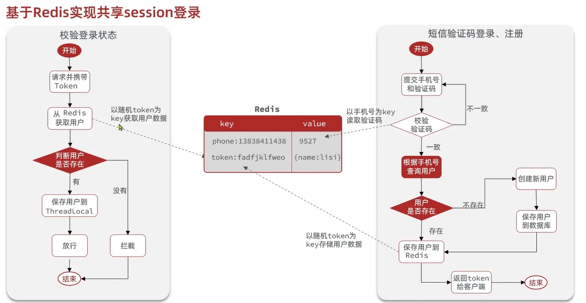

# 基于 Session 的短信登录完整解析

在现代 Web 应用中，**短信验证码登录** 是一种非常常见的无密码认证方式。它的好处是简单、安全，用户只需要输入手机号和验证码即可登录，而不用记复杂的密码。  

很多初学者在实现时会有疑惑：**验证码存哪？怎么比对？登录状态如何保持？** 这篇文章将通过推导的方式，逐步解释清楚，并给出完整的代码示例。  

---

## 一、为什么需要 Session

要理解短信登录，必须先搞清楚 **Session** 的概念。  

HTTP 协议的一个最大特点是：**无状态**。  
这意味着每一次请求，服务器都不会记得你是谁。  

但是在实际应用里，我们需要：  

- 登录之后，保持登录状态  
- 购物车内容能够一直保存  
- 验证码发送后，能够正确地校验  

这时候就需要 **Session**。  

### 1.1 Session 的类比

你可以把 **Session** 想象成服务器给用户开的一间小储物柜：  

- 当用户第一次访问时，服务器（tomcat）分配一个储物柜（Session），并生成一个唯一编号（Session ID）  
- 服务器把这个编号写在一张小纸条上（Cookie），交给浏览器（客户端）保存  
- 以后浏览器每次访问时，都会带上这张小纸条  
- 服务器根据纸条上的编号，就能找到对应的储物柜，从里面取出属于该用户的数据  


---

### 1.2 Session vs Cookie

| 特性       | Cookie（小纸条）            | Session（储物柜）         |
|------------|-----------------------------|----------------------------|
| 存储位置    | 浏览器端                     | 服务器端                   |
| 安全性     | 较低（容易被篡改）            | 较高（由服务器维护）       |
| 容量       | 4KB 左右                     | 取决于服务器内存           |
| 生命周期   | 可设置长时间保存              | 默认随浏览器关闭或超时清除 |

---

## 二、短信登录的推导过程

现在我们把 Session 的原理放到 **短信验证码登录** 的场景中，来一步步推导。

### 2.1 用户提交手机号

- 用户在前端页面输入手机号  
- 前端把手机号发送给后端  

### 2.2 服务器生成验证码

- 后端生成一个 6 位随机数（例如 `123456`）  
- 把这个验证码保存到 **Session 储物柜** 里  
- 同时调用短信服务商的 API，把验证码发送到用户手机  

此时，**Session 中保存的是：**
key = "SMS_CODE_手机号"
value = "123456"

### 2.3 用户输入验证码登录

- 用户收到验证码，在页面输入  
- 浏览器在发起请求时，会自动带上 Session ID 的小纸条（Cookie）  
- 后端根据 Session ID 找到储物柜，从中取出验证码  
- 比对用户输入的验证码与 Session 中保存的验证码  
  - 一致 ✅ → 登录成功  
  - 不一致 ❌ → 登录失败  



---

## 三、代码实现示例（Spring Boot）

接下来用 Java + Spring Boot 来实现一个最简化的 **基于 Session 的短信登录**。  

### 3.1 发送验证码接口

```java
@RestController
@RequestMapping("/auth")
public class SmsLoginController {

    @PostMapping("/sendCode")
    public ResponseEntity<String> sendCode(@RequestParam String phone, HttpSession session) {
        // 生成 6 位验证码
        String code = String.valueOf((int)((Math.random() * 9 + 1) * 100000));

        // 模拟发送短信（真实情况需接入短信服务商 API）
        System.out.println("向手机号 " + phone + " 发送验证码：" + code);

        // 保存到 session
        session.setAttribute("SMS_CODE_" + phone, code);
        session.setAttribute("SMS_CODE_TIME_" + phone, System.currentTimeMillis());

        return ResponseEntity.ok("验证码已发送");
    }
}
```
说明：
验证码保存在 Session 中，不存前端
建议同时保存验证码生成时间，方便后续判断是否过期
### 3.2 验证登录接口
```java
@PostMapping("/login")
public ResponseEntity<String> login(@RequestParam String phone,
                                    @RequestParam String code,
                                    HttpSession session) {
    String sessionCode = (String) session.getAttribute("SMS_CODE_" + phone);
    Long codeTime = (Long) session.getAttribute("SMS_CODE_TIME_" + phone);

    if (sessionCode == null) {
        return ResponseEntity.status(400).body("验证码未发送或已过期");
    }

    // 验证是否过期（5分钟有效）
    if (System.currentTimeMillis() - codeTime > 5 * 60 * 1000) {
        session.removeAttribute("SMS_CODE_" + phone);
        session.removeAttribute("SMS_CODE_TIME_" + phone);
        return ResponseEntity.status(400).body("验证码已过期");
    }

    if (!sessionCode.equals(code)) {
        return ResponseEntity.status(400).body("验证码错误");
    }

    // 登录成功，写入用户登录状态
    session.setAttribute("LOGIN_USER", phone);

    // 清理验证码
    session.removeAttribute("SMS_CODE_" + phone);
    session.removeAttribute("SMS_CODE_TIME_" + phone);

    return ResponseEntity.ok("登录成功");
}

```
说明：
核心逻辑在 后端比对，前端只负责收集输入
验证码过期机制必须有，防止重复使用
### 3.3 获取当前登录用户接口
```java
@GetMapping("/me")
public ResponseEntity<String> getUser(HttpSession session) {
    String phone = (String) session.getAttribute("LOGIN_USER");
    if (phone == null) {
        return ResponseEntity.status(401).body("未登录");
    }
    return ResponseEntity.ok("当前登录用户：" + phone);
}
```

## 四、关键点总结
#### 1.Session 是储物柜，Cookie 是储物柜的取件凭证证
- 验证码存放在 Session（服务器端），不存浏览器
- 浏览器只保留 Session ID（Cookie）
#### 2.比对逻辑必须在后端完成
- 前端只负责收集和提交手机号、验证码
- 服务器根据 Session 找到验证码并比对，决定是否登录
#### 3.安全性措施
- 验证码要有过期时间（一般 5 分钟）
- 验证码要有发送频率限制，防止被恶意刷  
## 五、流程回顾
### 让我们回顾整个短信登录的过程：
##### 1.用户输入手机号
##### 2.服务器生成验证码，存到 Session，并通过短信发送
##### 3.用户收到验证码，输入到前端页面
##### 4.浏览器请求时带上 Cookie（Session ID）
##### 5.服务器用 Session ID 找到储物柜，取出验证码进行比对
- 一致 → 登录成功；
- 不一致/过期 → 登录失败        

### 6.扩展思考
在实际生产环境中，Session 可能存放在 Redis 里，以便支持分布式部署。

另外，也可以替代 Session，用 **JWT（JSON Web Token）** 实现无状态的登录。
但核心思想是一致的：
- 验证码必须在后端保存和比对
- 前端只负责展示和输入
### 7.结语
通过上面的推导，我们把“短信登录”这个常见需求，完整地拆解成了 业务流程 + Session 原理 + 实现代码。

如果你刚开始学习后端开发，希望你能从这篇文章中真正理解：
- 为什么要用 Session
- 短信验证码应该存放在哪里
- 验证逻辑为什么要在后端
  
这样，不管是做一个小 demo，还是将来应对生产级的项目，你都能举一反三。
